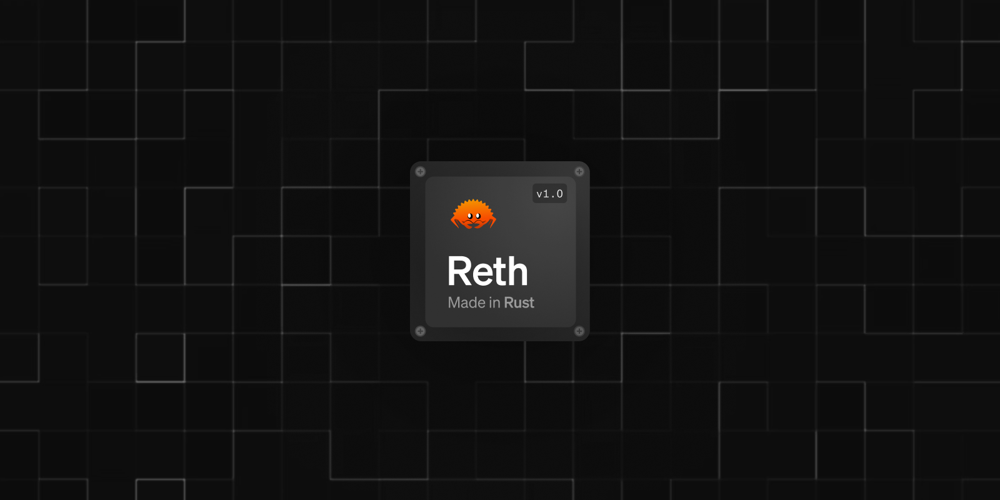

# Reth  

[][gh-ci]  
[][gh-deny]  

**A modular, contributor-friendly, and blazing-fast implementation of the Ethereum protocol**  

  

### Quick Links:  
- **[Install](https://paradigmxyz.github.io/reth/installation/installation.html)**  
- [User Guide](https://reth.rs)  
- [Developer Documentation](./docs)  
- [Crate Documentation](https://reth.rs/docs)  

[gh-ci]: https://github.com/paradigmxyz/reth/actions/workflows/unit.yml  
[gh-deny]: https://github.com/paradigmxyz/reth/actions/workflows/deny.yml  
[tg-badge]: https://img.shields.io/endpoint?color=neon&logo=telegram&label=chat&url=https%3A%2F%2Ftg.sumanjay.workers.dev%2Fparadigm%5Freth  

## What is Reth?  

Reth (short for Rust Ethereum, [pronunciation](https://twitter.com/kelvinfichter/status/1597653609411268608)) is a modern Ethereum full-node implementation designed to be user-friendly, highly modular, and performance-driven. It serves as an Execution Layer (EL) node, fully compatible with all Ethereum Consensus Layer (CL) implementations that support the [Engine API](https://github.com/ethereum/execution-apis/tree/a0d03086564ab1838b462befbc083f873dcf0c0f/src/engine).  

Developed and maintained by [Paradigm](https://paradigm.xyz/), Reth is distributed under the permissive Apache and MIT licenses.  

## Goals  

Reth enables users to connect to the Ethereum network, send/receive transactions, access blockchain data, and interact with smart contracts. Its primary objectives include:  

1. **Modularity**: Every component of Reth is designed as a reusable library—thoroughly tested, well-documented, and benchmarked. Developers can import its crates, customize functionalities, and build unique use cases. Examples include creating standalone P2P networks, interacting directly with the node database, or unbundling specific features.  
2. **Performance**: Reth is engineered for speed using Rust and the [Erigon staged-sync](https://erigon.substack.com/p/erigon-stage-sync-and-control-flows) architecture. Its components, like [Alloy](https://github.com/alloy-rs/alloy/) and [revm](https://github.com/bluealloy/revm/), are optimized through extensive testing.  
3. **Open and Free**: Licensed under Apache/MIT, Reth encourages unrestricted usage without concerns over restrictive business or GPL-like licenses.  
4. **Client Diversity**: A diverse Ethereum ecosystem is more resilient to bugs and vulnerabilities. By introducing Reth, we aim to enhance the network's robustness.  
5. **Multi-Chain Support**: Reth aspires to support not only Ethereum but also EVM-compatible chains such as Optimism, Polygon, and Binance Smart Chain.  
6. **Configurability**: Reth caters to a variety of users, from hobbyists with limited hardware to professionals seeking optimal performance. Configurable profiles allow flexibility for different trade-offs, including full sync and fast sync modes.  

## Current Status  

Reth is production-ready and recommended for mission-critical applications like staking, high-uptime services, RPC, MEV, indexing, and simulations.  

### Milestones  
- **June 2024**: Released Reth 1.0, labeled “production-ready.”  
  - Audited by [Sigma Prime](https://sigmaprime.io/) ([audit report](./audit/sigma_prime_audit_v2.pdf)).  
  - [Revm](https://github.com/bluealloy/revm/) underwent a security audit by [Guido Vranken](https://twitter.com/guidovranken).  
- Iterative updates through beta and alpha phases, starting with [alpha.1](https://github.com/paradigmxyz/reth/releases/tag/v0.1.0-alpha.1) in June 2023.  

### Database Compatibility  

No database-breaking changes have occurred since beta.1. However, users with pre-beta databases must drop and resync using the latest commands.  

## User Resources  

- **[Installation Guide](https://paradigmxyz.github.io/reth/installation/installation.html)**  
- **[Reth User Guide](https://reth.rs)**  

## Developer Resources  

### Using Reth as a Library  

Reth’s crates are modular and can be used independently in projects. See the [Crate Documentation](https://reth.rs/docs) for details.  

### Contributing  

Contributions are welcome! Join discussions on [Telegram](https://t.me/paradigm_reth), or check out:  
- [`CONTRIBUTING.md`](./CONTRIBUTING.md)  
- [Contributor Docs](./docs)  

### Building and Testing  

The Minimum Supported Rust Version (MSRV) is [1.82.0](https://blog.rust-lang.org/2024/10/17/Rust-1.82.0.html).  

1. Clone the repository:  
   ```sh
   git clone https://github.com/paradigmxyz/reth
   cd reth
   ```  
2. Run tests:  
   - Without Geth: `cargo test --workspace`  
   - With Geth: `cargo test --workspace --features geth-tests`  

For faster tests, use [`cargo nextest`](https://nexte.st/).  

## Need Help?  

- Check the [Reth Book](https://paradigmxyz.github.io/reth/) for answers.  
- Join our [Telegram chat][tg-url].  
- Open a [discussion](https://github.com/paradigmxyz/reth/discussions/new) or a [bug report](https://github.com/paradigmxyz/reth/issues/new).  

## Security  

Refer to [`SECURITY.md`](./SECURITY.md).  

## Acknowledgments  

Special thanks to:  
- **[Geth](https://github.com/ethereum/go-ethereum)** for years of foundational work.  
- **[Erigon](https://github.com/ledgerwatch/erigon)** for pioneering the "Staged Sync" architecture.  
- **[Akula](https://github.com/akula-bft/akula/)** for their Apache-licensed libraries, which accelerated Reth's development.  

---

This version emphasizes clarity and professional tone while maintaining the structure and technical details.
