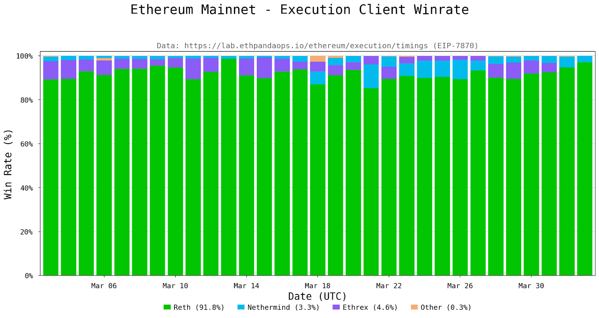
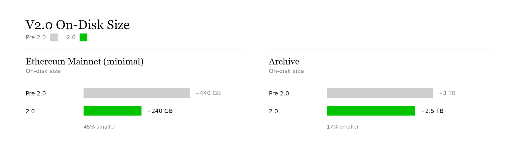

# reth

[](https://github.com/paradigmxyz/reth/actions/workflows/bench.yml)
[][gh-ci]
[][gh-lint]
[![Telegram Chat][tg-badge]][tg-url]

**Modular, contributor-friendly and blazing-fast implementation of the Ethereum protocol**


**[Install](https://reth.rs/installation/installation)**
| [User Docs](https://reth.rs)
| [Developer Docs](./docs)
| [Crate Docs](https://reth.rs/docs)

[gh-ci]: https://github.com/paradigmxyz/reth/actions/workflows/unit.yml
[gh-lint]: https://github.com/paradigmxyz/reth/actions/workflows/lint.yml
[tg-badge]: https://img.shields.io/endpoint?color=neon&logo=telegram&label=chat&url=https%3A%2F%2Ftg.sumanjay.workers.dev%2Fparadigm%5Freth

## What is Reth?

Reth (short for Rust Ethereum, [pronunciation](https://x.com/kelvinfichter/status/1597653609411268608)) is a production-ready Ethereum execution layer client focused on modularity, performance, and user-friendliness. Reth is compatible with all Ethereum Consensus Layer (CL) implementations that support the [Engine API](https://github.com/ethereum/execution-apis/tree/a0d03086564ab1838b462befbc083f873dcf0c0f/src/engine). It is built and driven forward by [Paradigm](https://paradigm.xyz/), and is licensed under the Apache and MIT licenses.

> **Note:** OP-Reth has moved to [ethereum-optimism/optimism](https://github.com/ethereum-optimism/optimism). Git history has been preserved.

## Goals

1. **Modularity**: Every component is built to be used as a library: well-tested, documented and benchmarked. Import crates, mix and match, and innovate on top of them. Learn more about the project's components [here](./docs/repo/layout.md).
2. **Performance**: Built with Rust, [Alloy](https://github.com/alloy-rs/alloy/), [revm](https://github.com/bluealloy/revm/), and [Foundry](https://github.com/foundry-rs/foundry/) — battle-tested and optimized for speed. Check the [ethPandaOps Lab Dashboard](https://lab.ethpandaops.io/ethereum/execution/timings) for a third-party comparison against other Ethereum clients.
Here's what that looks like in practice, measured with [reth-bench](https://github.com/paradigmxyz/reth/tree/main/bin/reth-bench) on Ethereum Mainnet:



3. **Free for anyone to use any way they want**: Apache/MIT licensed, no business license restrictions.
4. **Client Diversity**: More client implementations make Ethereum more antifragile.
5. **Support as many EVM chains as possible**: Reth can sync Ethereum and other EVM chains. If you're building one, reach out.
6. **Configurability**: Profiles for different use cases — from high-performance RPC operators to hobbyists on consumer hardware.

## Status

Reth is production ready, and suitable for usage in mission-critical environments such as staking or high-uptime services. We also actively recommend professional node operators to switch to Reth in production for performance and cost reasons in use cases where high performance with great margins is required such as RPC, MEV, Indexing, Simulations, and P2P activities.

- We released **Reth 2.0** in April 2026. See the [release notes](https://github.com/paradigmxyz/reth/releases/tag/v2.0.0) and [blog post](https://www.paradigm.xyz/2026/04/releasing-reth-2-0).
- We released 1.0 "production-ready" stable Reth in June 2024.
  - Reth completed an audit with [Sigma Prime](https://sigmaprime.io/), the developers of [Lighthouse](https://github.com/sigp/lighthouse), the Rust Consensus Layer implementation. Find it [here](./audit/sigma_prime_audit_v2.pdf).
  - Revm (the EVM used in Reth) underwent an audit with [Guido Vranken](https://x.com/guidovranken) (#1 [Ethereum Bug Bounty](https://ethereum.org/en/bug-bounty)).
- We released multiple iterative beta versions, up to [beta.9](https://github.com/paradigmxyz/reth/releases/tag/v0.2.0-beta.9) on Monday June 3, 2024, the last beta release.
- We released [beta](https://github.com/paradigmxyz/reth/releases/tag/v0.2.0-beta.1) on Monday March 4, 2024, our first breaking change to the database model, providing faster query speed, smaller database footprint, and allowing "history" to be mounted on separate drives.
- We shipped iterative improvements until the last alpha release on February 28, 2024, [0.1.0-alpha.21](https://github.com/paradigmxyz/reth/releases/tag/v0.1.0-alpha.21).
- We [initially announced](https://www.paradigm.xyz/2023/06/reth-alpha) [0.1.0-alpha.1](https://github.com/paradigmxyz/reth/releases/tag/v0.1.0-alpha.1) on June 20, 2023.

### Storage compatibility

Storage V2 is the default for new nodes in Reth 2.0. Existing V1 nodes continue to work, but V1 support will be removed in a future release — all users are encouraged to migrate. V2 snapshots are available at [snapshots.reth.rs](https://snapshots.reth.rs/).



## For Users

See the [Reth documentation](https://reth.rs/) for instructions on how to install and run Reth.

## For Developers

### Using reth as a library

You can use individual crates of reth in your project.

The crate docs can be found [here](https://reth.rs/docs/).

For a general overview of the crates, see [Project Layout](./docs/repo/layout.md).

### Contributing

If you want to contribute, or follow along with contributor discussion, you can use our [main telegram](https://t.me/paradigm_reth) to chat with us about the development of Reth!

- Our contributor guidelines can be found in [`CONTRIBUTING.md`](./CONTRIBUTING.md).
- See our [contributor docs](./docs) for more information on the project. A good starting point is [Project Layout](./docs/repo/layout.md).

### Building and testing

<!--
When updating this, also update:
- Cargo.toml
- .github/workflows/lint.yml
-->

The Minimum Supported Rust Version (MSRV) of this project is [1.93.0](https://blog.rust-lang.org/2026/01/22/Rust-1.93.0/).

See the docs for detailed instructions on how to [build from source](https://reth.rs/installation/source/).

To fully test Reth, you will need to have [Geth installed](https://geth.ethereum.org/docs/getting-started/installing-geth), but it is possible to run a subset of tests without Geth.

First, clone the repository:

```sh
git clone https://github.com/paradigmxyz/reth
cd reth
```

Next, run the tests:

```sh
cargo nextest run --workspace

# Run the Ethereum Foundation tests
make ef-tests
```

We highly recommend using [`cargo nextest`](https://nexte.st/) to speed up testing.
Using `cargo test` to run tests may work fine, but this is not tested and does not support more advanced features like retries for spurious failures.

> **Note**
>
> Some tests use random number generators to generate test data. If you want to use a deterministic seed, you can set the `SEED` environment variable.

## Getting Help

If you have any questions, first see if the answer to your question can be found in the [docs][book].

If the answer is not there:

- Join the [Telegram][tg-url] to get help, or
- Open a [discussion](https://github.com/paradigmxyz/reth/discussions/new) with your question, or
- Open an issue with [the bug](https://github.com/paradigmxyz/reth/issues/new?assignees=&labels=C-bug%2CS-needs-triage&projects=&template=bug.yml)

## Security

See [`SECURITY.md`](./SECURITY.md).

## Acknowledgements

Reth is a new implementation of the Ethereum protocol. In the process of developing the node we investigated the design decisions other nodes have made to understand what is done well, what is not, and where we can improve the status quo.

None of this would have been possible without them, so big shoutout to the teams below:

- [Geth](https://github.com/ethereum/go-ethereum/): We would like to express our heartfelt gratitude to the go-ethereum team for their outstanding contributions to Ethereum over the years. Their tireless efforts and dedication have helped to shape the Ethereum ecosystem and make it the vibrant and innovative community it is today. Thank you for your hard work and commitment to the project.
- [Erigon](https://github.com/ledgerwatch/erigon) (fka Turbo-Geth): Erigon pioneered the ["Staged Sync" architecture](https://erigon.substack.com/p/erigon-stage-sync-and-control-flows) that Reth is using, as well as [introduced MDBX](https://github.com/ledgerwatch/erigon/wiki/Choice-of-storage-engine) as the database of choice. We thank Erigon for pushing the state of the art research on the performance limits of Ethereum nodes.
- [Akula](https://github.com/akula-bft/akula/): Reth uses forks of the Apache versions of Akula's [MDBX Bindings](https://github.com/paradigmxyz/reth/pull/132), [FastRLP](https://github.com/paradigmxyz/reth/pull/63) and [ECIES](https://github.com/paradigmxyz/reth/pull/80). Given that these packages were already released under the Apache License, and they implement standardized solutions, we decided not to reimplement them to iterate faster. We thank the Akula team for their contributions to the Rust Ethereum ecosystem and for publishing these packages.

## Warning

The `NippyJar` and `Compact` encoding formats and their implementations are designed for storing and retrieving data internally. They are not hardened to safely read potentially malicious data.

[book]: https://reth.rs/
[tg-url]: https://t.me/paradigm_reth
