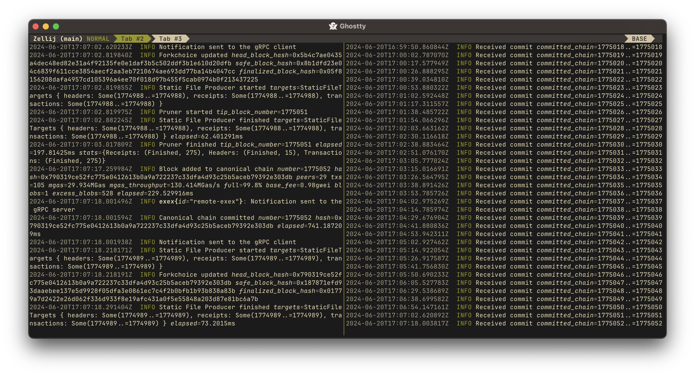

# Remote Execution Extensions

In this chapter, we will learn how to create an ExEx that emits all notifications to an external process.

We will use [Tonic](https://github.com/hyperium/tonic) to create a gRPC server and a client.
- The server binary will have the Reth client, our ExEx and the gRPC server.
- The client binary will have the gRPC client that connects to the server.

## Prerequisites

See [section](https://github.com/hyperium/tonic?tab=readme-ov-file#dependencies) of the Tonic documentation
to install the required dependencies.

## Create a new project

Let's create a new project. Don't forget to provide the `--lib` flag to `cargo new`,
because we will have two custom binaries in this project that we will create manually.

```console
$ cargo new --lib exex-remote
$ cd exex-remote
```

We will also need a bunch of dependencies. Some of them you know from the [Hello World](./hello-world.md) chapter,
but some of specific to what we need now.

```toml
{{#include ../../sources/exex/remote/Cargo.toml}}
```

We also added a build dependency for Tonic. We will use it to generate the Rust code for our
Protobuf definitions at compile time. Read more about using Tonic in the
[introductory tutorial](https://github.com/hyperium/tonic/blob/6a213e9485965db0628591e30577ed81cdaeaf2b/examples/helloworld-tutorial.md).

Also, we now have two separate binaries:
- `exex` is the server binary that will run the ExEx and the gRPC server.
- `consumer` is the client binary that will connect to the server and receive notifications.

### Create the Protobuf definitions

In the root directory of your project (not `src`), create a new directory called `proto` and a file called `exex.proto`.

We define a service called `RemoteExEx` that exposes a single method called `Subscribe`.
This method streams notifications to the client.

<div class="warning">

A proper way to represent the notification would be to define all fields in the schema, but it goes beyond the scope
of this chapter.

For an example of a full schema, see the [Remote ExEx](https://github.com/paradigmxyz/reth-exex-examples/blob/1f74410740ac996276a84ee72003f4f9cf041491/remote/proto/exex.proto) example.

</div>

```protobuf
{{#include ../../sources/exex/remote/proto/exex.proto}}
```

To instruct Tonic to generate the Rust code using this `.proto`, add the following lines to your `lib.rs` file:
```rust,norun,noplayground,ignore
{{#include ../../sources/exex/remote/src/lib.rs}}
```

## ExEx and gRPC server

We will now create the ExEx and the gRPC server in our `src/exex.rs` file.

### gRPC server

Let's create a minimal gRPC server that listens on the port `:10000`, and spawn it using
the [NodeBuilder](https://reth.rs/docs/reth/builder/struct.NodeBuilder.html)'s [task executor](https://reth.rs/docs/reth/tasks/struct.TaskExecutor.html).

```rust,norun,noplayground,ignore
{{#include ../../sources/exex/remote/src/exex_1.rs}}
```

Currently, it does not send anything on the stream.
We need to create a communication channel between our future ExEx and this gRPC server
to send new `ExExNotification` on it.

Let's create this channel in the `main` function where we will have both gRPC server and ExEx initiated,
and save the sender part (that way we will be able to create new receivers) of this channel in our gRPC server.

```rust,norun,noplayground,ignore
{{#include ../../sources/exex/remote/src/exex_2.rs}}
```

And with that, we're ready to handle incoming notifications, serialize them with [bincode](https://docs.rs/bincode/)
and send back to the client.

For each incoming request, we spawn a separate tokio task that will run in the background,
and then return the stream receiver to the client.

```rust,norun,noplayground,ignore
{{#rustdoc_include ../../sources/exex/remote/src/exex_3.rs:snippet}}
```

That's it for the gRPC server part! It doesn't receive anything on the `notifications` channel yet,
but we will fix it with our ExEx.

### ExEx

Now, let's define the ExEx part of our binary.

Our ExEx accepts a `notifications` channel and redirects all incoming `ExExNotification`s to it.

<div class="warning">

Don't forget to emit `ExExEvent::FinishedHeight`

</div>

```rust,norun,noplayground,ignore
{{#rustdoc_include ../../sources/exex/remote/src/exex_4.rs:snippet}}
```

All that's left is to connect all pieces together: install our ExEx in the node and pass the sender part
of communication channel to it.

```rust,norun,noplayground,ignore
{{#rustdoc_include ../../sources/exex/remote/src/exex.rs:snippet}}
```

### Full `exex.rs` code

<details>
<summary>Click to expand</summary>
  
```rust,norun,noplayground,ignore
{{#include ../../sources/exex/remote/src/exex.rs}}
```
</details>

## Consumer

Consumer will be a much simpler binary that just connects to our gRPC server and prints out all the notifications
it receives.

<div class="warning">

We need to increase maximum message encoding and decoding sizes to `usize::MAX`,
because notifications can get very heavy

</div>

```rust,norun,noplayground,ignore
{{#include ../../sources/exex/remote/src/consumer.rs}}
```

## Running

In one terminal window, we will run our ExEx and gRPC server. It will start syncing Reth on the Holesky chain
and use Etherscan in place of a real Consensus Client. Make sure to have `ETHERSCAN_API_KEY` on your env.

```console
export ETHERSCAN_API_KEY={YOUR_API_KEY} && cargo run --bin exex --release -- node --chain holesky --debug.etherscan
```

And in the other, we will run our consumer:

```console
cargo run --bin consumer --release
```


