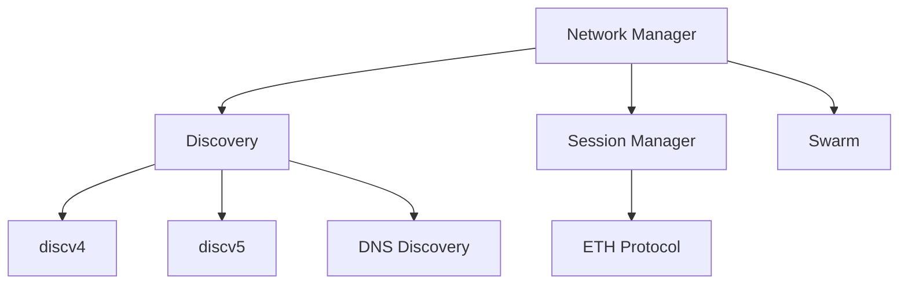

# Network Component

The network component handles all peer-to-peer communication in Reth, including peer discovery, connection management, and protocol message handling.

## Overview

The network stack implements the Ethereum Wire Protocol (ETH) and provides:
- Peer discovery via discv4 and discv5
- Connection management with configurable peer limits
- Transaction propagation
- State synchronization
- Request/response protocols (e.g. GetBHeaders, GetBodies)

## Architecture

## Key Concepts

### Peer Discovery
The network uses multiple discovery mechanisms to find and connect to peers:
- **discv4**: UDP-based discovery protocol for finding peers
- **discv5**: Improved discovery protocol with better security
- **DNS Discovery**: Peer lists published via DNS for bootstrap

### Connection Management
- Maintains separate limits for inbound and outbound connections
- Implements peer scoring and reputation tracking
- Handles connection lifecycle and graceful disconnections

### Protocol Support
- **ETH Protocol**: Core Ethereum wire protocol for blocks and transactions

### Message Broadcasting
The network efficiently propagates new blocks and transactions to peers using:
- Transaction pooling and deduplication
- Block announcement strategies
- Bandwidth management

## Next Steps

- Learn about the [Transaction Pool](/sdk/node-components/pool)
- Understand [Consensus](/sdk/node-components/consensus) integration
- Explore [RPC](/sdk/node-components/rpc) server setup