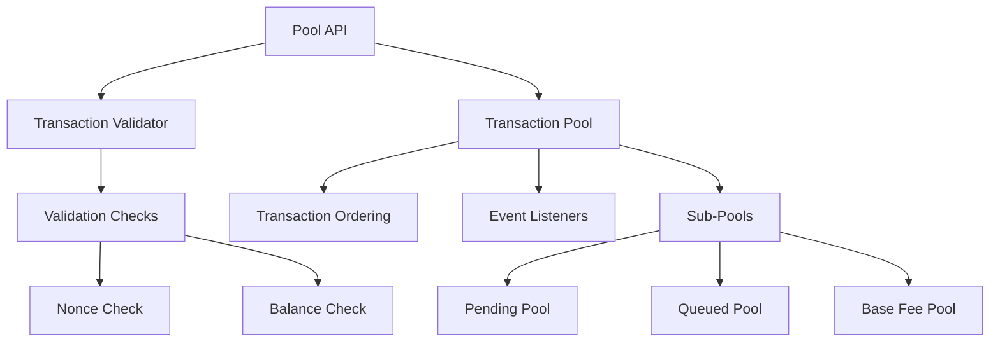

# Transaction Pool Component

The transaction pool (mempool) manages pending transactions before they are included in blocks. It handles validation, ordering, replacement, and eviction of transactions.

## Overview

The transaction pool is responsible for:
- Validating incoming transactions
- Maintaining transaction ordering (e.g. by fees)
- Handling transaction replacement
- Managing pool size limits
- Broadcasting transactions to peers
- Providing transactions for block building

## Architecture

## Key Concepts

### Transaction Validation
The pool validates transactions before accepting them, checking:
- Sender has sufficient balance for gas and value
- Nonce is correct (either next expected or future)
- Gas price meets minimum requirements
- Transaction size is within limits
- Signature is valid

### Transaction Ordering
Transactions are ordered by their effective tip per gas to maximize block rewards. Custom ordering strategies can prioritize certain addresses or implement MEV protection.

### Sub-Pools
- **Pending**: Transactions ready for inclusion (correct nonce)
- **Queued**: Future transactions (nonce gap exists)
- **Base Fee**: Transactions priced below current base fee

### Pool Maintenance
The pool requires periodic maintenance to:
- Remove stale transactions
- Revalidate after chain reorganizations
- Update base fee thresholds
- Enforce size limits

## Advanced Features

### Blob Transaction Support
EIP-4844 introduces blob transactions with separate blob storage and special validation rules.

### Transaction Filters
Custom filters can block specific addresses, limit gas prices, or implement custom acceptance criteria.

### Event System
The pool supports an event system that allows other components to listen for transaction lifecycle events such as:
- Transaction added
- Transaction removed
- Transaction replaced
- Transaction promoted to pending state

## Next Steps

- Learn about [Consensus](/sdk/node-components/consensus) validation
- Explore [EVM](/sdk/node-components/evm) execution
- Understand [RPC](/sdk/node-components/rpc) server integration