# State Root Calculation of Engine Payloads

The heart of Reth is the Engine, which is responsible for driving the chain forward.
Each time it receives a new payload ([engine_newPayloadV4](https://github.com/ethereum/execution-apis/blob/main/src/engine/prague.md#engine_newpayloadv4)
at the time of writing this document), it does a bunch of validations, executes the block
contained in the payload, calculates the [MPT](https://ethereum.org/en/developers/docs/data-structures-and-encoding/patricia-merkle-trie/)
root of the new state, compares it with the one received in the block header,
and then considers the block committed.

This document describes the lifecycle of a payload with the focus on state root calculation,
from the moment the payload is received, to the moment we have a new state root.

We will look at the following components:
- [Engine](#engine)
- [State Root Task](#state-root-task)
- [MultiProof Manager](#multiproof-manager)
- [Sparse Trie Task](#sparse-trie-task)

## Engine

It all starts with the `engine_newPayload` request coming from the [Consensus Client](https://ethereum.org/en/developers/docs/nodes-and-clients/#consensus-clients).

We extract the block from the payload, and eventually pass it to the `EngineApiTreeHandler::insert_block_inner`
method, https://github.com/paradigmxyz/reth/blob/2ba54bf1c1f38c7173838f37027315a09287c20a/crates/engine/tree/src/tree/mod.rs#L2359-L2362

First, we spawn the [State Root Task](#state-root-task) thread, which will receive the updates from
execution and calculate the state root. https://github.com/paradigmxyz/reth/blob/2ba54bf1c1f38c7173838f37027315a09287c20a/crates/engine/tree/src/tree/mod.rs#L2449-L2458

Then, we do two things with the block:
1. Start prewarming each transaction in a separate thread ("Prewarming thread" on the above diagram).
https://github.com/paradigmxyz/reth/blob/2ba54bf1c1f38c7173838f37027315a09287c20a/crates/engine/tree/src/tree/mod.rs#L2490-L2507
    - Each transaction is optimistically executed in parallel with each other on top of the previous block,
    but the results are not committed to the database.
    - All accounts and storage slots that were accessed are cached in memory, so that the actual execution
    can use them instead of going to the disk.
    - All modified accounts and storage slots are sent as `StateRootMessage::PrefetchProofs`
    to the [State Root Task](#state-root-task).
    - Some transactions will fail, because they require the previous transactions to be executed first.
2. Execute transactions sequentially.
https://github.com/paradigmxyz/reth/blob/2ba54bf1c1f38c7173838f37027315a09287c20a/crates/engine/tree/src/tree/mod.rs#L2523
    - Transactions are executed one after another, and use the accounts and storage slots cache
    from the prewarming step, if it's available.
    - All modified accounts and storage slots are sent as `StateRootMessage::StateUpdate`
    to the [State Root Task](#state-root-task).
    - When all transactions are executed, the `StateRootMessage::FinishedStateUpdates` is sent
    to the [State Root Task](#state-root-task).

Eventually, the Engine will receive the `StateRootMessage::RootCalculated` message from
the [State Root Task](#state-root-task) thread, and will use the new state root to decide
the `engine_newPayload` response.

## State Root Task

State Root Task is a component responsible for receiving the state updates from the [Engine](#engine),
issuing requests for generating proofs to the [MultiProof Manager](#multiproof-manager),
updating the sparse trie using the [Sparse Trie Task](#sparse-trie-task),
and finally sending the state root back to the [Engine](#engine).

At its core, it's a state machine that receives messages from other components, and handles them accordingly.
https://github.com/paradigmxyz/reth/blob/2ba54bf1c1f38c7173838f37027315a09287c20a/crates/engine/tree/src/tree/root.rs#L726

### Generating proof targets

State root calculation in the [Sparse Trie Task](#sparse-trie-task) relies on:
1. Revealing nodes in the trie according to [MPT (Merkle Patricia Trie) proofs](https://docs.chainstack.com/docs/deep-dive-into-merkle-proofs-and-eth-getproof-ethereum-rpc-method).
2. Updating the trie according to the state updates received from executing the transactions.

Let's look at the first two messages on the diagram: `StateRootMessage::StateUpdate`
and `StateRootMessage::PrefetchProofs`. They are sent from the previous [Engine](#engine) step,
and first used to form the proofs targets.

Proof targets are a list of accounts and storage slots that we send to
the [MultiProof Manager](#multiproof-manager) to generate the MPT proofs.
https://github.com/paradigmxyz/reth/blob/2ba54bf1c1f38c7173838f37027315a09287c20a/crates/trie/common/src/proofs.rs#L20-L21

Before sending them, we first deduplicate the list of targets according to a list of proof targets
that were already fetched.
https://github.com/paradigmxyz/reth/blob/2ba54bf1c1f38c7173838f37027315a09287c20a/crates/engine/tree/src/tree/root.rs#L1022-L1028 

This deduplication step is important, because if two transactions modify the same account or storage slot,
we only need to fetch the MPT proof once.

Then, the proof targets are passed to the [`MultiProofManager::spawn_or_queue`](#multiproof-manager) method.

### Sequencing calculated proofs

When the [MultiProof Manager](#multiproof-manager) finishes calculating the proof, it sends
a message back to the State Root Task. It can be either:
1. `StateRootMessage::EmptyProof` if the deduplication of proof targets resulted in an empty list.
2. `StateRootMessage::ProofCalculated(proof, state)` with the MPT proof calculated for the targets,
along with the state update that the proof was generated for.

On any message, we call the [`MultiProofManager::on_calculation_complete`](#multiproof-manager) method
to signal that the proof calculation is finished.

Some proofs can arrive earlier than others, even though they were requested later. It depends on the number
of proof targets, and also some non-determinism in the database caching.

The issue with this is that we need to ensure that the proofs are sent
to the [Sparse Trie Task](#sparse-trie-task) in the order that they were requested. Because of this,
we introduced a `ProofSequencer` that we add new proofs to.
https://github.com/paradigmxyz/reth/blob/2ba54bf1c1f38c7173838f37027315a09287c20a/crates/engine/tree/src/tree/root.rs#L666-L672

`ProofSequencer` acts in the following way:
1. Each proof has an associated "sequence number" that determines the original order of state updates.
2. When the proof is calculatd, it's added to the `ProofSequencer` with the sequence number
and state update associated with it.
3. If the `ProofSequencer` has a consecutive sequence of proofs without gaps in sequence numbers, it returns this sequence.

Once the `ProofSequencer` returns a sequence of proofs,
we send them along with the state updates to the [Sparse Trie Task](#sparse-trie-task).

### Finishing the calculation

Once all transactions are executed, the [Engine](#engine) sends a `StateRootMessage::FinishStateUpdates` message
to the State Root Task, marking the end of receiving state updates.

Every time we receive a new proof from the [MultiProof Manager](#multiproof-manager), we also check
the following conditions:
1. Are all updates received? (`StateRootMessage::FinishStateUpdates` was sent)
2. Is `ProofSequencer` empty? (no proofs are pending for sequencing)
3. Are all proofs that were sent to the [`MultiProofManager::spawn_or_queue`](#multiproof-manager) finished
calculating and were sent to the [Sparse Trie Task](#sparse-trie-task)?

https://github.com/paradigmxyz/reth/blob/2ba54bf1c1f38c7173838f37027315a09287c20a/crates/engine/tree/src/tree/root.rs#L935-L944

When all conditions are met, we close the [State Root Task](#state-root-task) receiver channel,
signaling that no proofs or state updates are coming anymore, and the state root calculation should be finished.

## MultiProof Manager

MultiProof manager is a component responsible for generating MPT proofs
and sending them back to the [State Root Task](#state-root-task).

### Spawning new proof calculations

The entrypoint is the `spawn_or_queue` method
https://github.com/paradigmxyz/reth/blob/2ba54bf1c1f38c7173838f37027315a09287c20a/crates/engine/tree/src/tree/root.rs#L355-L357

It has the following responsibilities:
1. On empty proof targets, immediately send `StateRootMessage::EmptyProof` to the [State Root Task](#state-root-task).
2. If the number of maximum concurrent proof calculations is reached, push the proof request to the pending queue.
3. If we can spawn a new proof calculation thread, spawn it using [`ParallelProof`](https://github.com/paradigmxyz/reth/blob/09a6aab9f7dc283e42fd00ce8f179542f8558580/crates/trie/parallel/src/proof.rs#L85),
and send `StateRootMessage::ProofCalculated` to the [State Root Task](#state-root-task) once it's done.

### Exhausting the pending queue

To exhaust the pending queue from the step 2 of the `spawn_or_queue` described above,
the [State Root Task](#state-root-task) calls into another method `on_calculation_complete` every time
a proof is calculated.
https://github.com/paradigmxyz/reth/blob/2ba54bf1c1f38c7173838f37027315a09287c20a/crates/engine/tree/src/tree/root.rs#L379-L387

Its main purpose is to spawn a new proof calculation thread and do the same as step 3 of the `spawn_or_queue` method
described above.

## Sparse Trie Task

