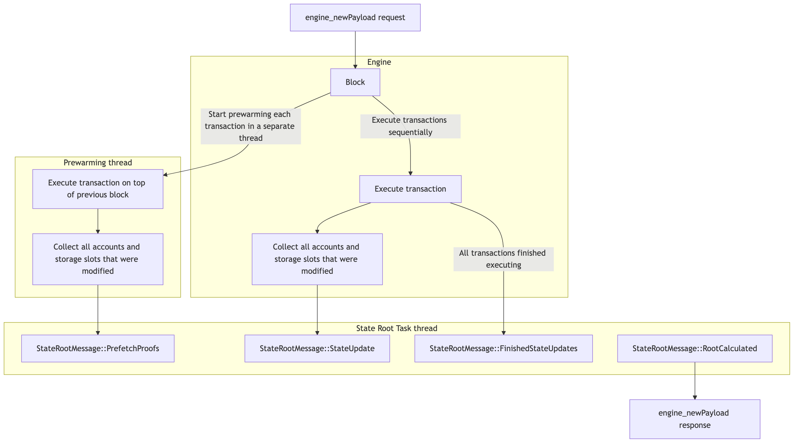

# State Root Calculation for Engine Payloads

The heart of Reth is the Engine, which is responsible for driving the chain forward.
Each time it receives a new payload ([engine_newPayloadV4](https://github.com/ethereum/execution-apis/blob/main/src/engine/prague.md#engine_newpayloadv4)
at the time of writing this document), it:
1. Does a bunch of validations.
2. Executes the block contained in the payload.
3. Calculates the [MPT](https://ethereum.org/en/developers/docs/data-structures-and-encoding/patricia-merkle-trie/)
root of the new state.
4. Compares the root with the one received in the block header.
5. Considers the block valid.

This document describes the lifecycle of a payload with a focus on state root calculation,
from the moment the payload is received, to the moment we have a new state root.

We will look at the following components:
- [Engine](#engine)
- [Payload Processor](#payload-processor)
- [Prewarming Task](#prewarming-task)
- [MultiProof Task](#multiproof-task)
- [Sparse Trie Task](#sparse-trie-task)

## Engine



It all starts with the `engine_newPayload` request coming from the [Consensus Client](https://ethereum.org/en/developers/docs/nodes-and-clients/#consensus-clients).

We extract the block from the payload, and eventually pass it to the `EngineApiTreeHandler::insert_block_inner`
method that executes the block and calculates the state root. 
https://github.com/paradigmxyz/reth/blob/2ba54bf1c1f38c7173838f37027315a09287c20a/crates/engine/tree/src/tree/mod.rs#L2359-L2362

Let's walk through the steps involved in the process.

First, we create a [Payload Processor](#payload-processor) instance that will orchestrate the execution
and state root calculation. The Payload Processor calls its `spawn()` method to create all the necessary 
background tasks and returns a `PayloadHandle` for coordinating the work.

The Payload Processor spawns the following background tasks:
1. **Transaction Prewarming Task**: Optimistically executes transactions in parallel
2. **Multi-proof Task**: Generates MPT proofs for state updates
3. **Sparse Trie Task**: Calculates the state root using the sparse trie

Once the tasks are spawned, the Engine performs payload execution in two phases:

### Phase 1: Transaction Prewarming
The prewarming task runs in the background and:
- Optimistically executes each transaction in parallel on top of the previous block
- Results are not committed to the database 
- Accessed accounts and storage slots are cached in memory for later use
- Modified accounts and storage slots are sent to the multi-proof task as prefetch requests
- Some transactions may fail due to dependencies, but this is acceptable since we only care about prewarming the cache

### Phase 2: Sequential Execution  
Transactions are executed sequentially:
- Each transaction is executed one after another in the correct order
- Accounts and storage slots are looked up from the prewarming cache when possible
- Modified accounts and storage slots are sent as state updates to the multi-proof task
- The multi-proof task generates proofs and forwards them to the sparse trie task
- When all transactions are executed, the tasks are signaled to finalize the state root calculation

Eventually, the Engine will receive the calculated state root from the [Payload Processor](#payload-processor)
via the `PayloadHandle`, and send the `engine_newPayload` response. The PayloadHandle provides a clean
interface to await the completion of all background tasks and retrieve the final state root.

## Payload Processor

The Payload Processor is the main orchestrator component responsible for coordinating the execution
and state root calculation process. It acts as the central hub that manages all background tasks
and handles the communication between them.

### Key Responsibilities

1. **Task Orchestration**: Spawns and manages all background tasks:
   - Transaction prewarming task
   - Multi-proof task
   - Sparse trie task

2. **Resource Management**: 
   - Manages execution cache and cross-block cache
   - Handles precompile cache mapping
   - Configures parallel vs serial sparse trie execution

3. **Configuration**: 
   - Applies TreeConfig settings (parallel sparse trie, cache sizes, etc.)
   - Manages EVM configuration for execution

### Task Spawning Process

When the PayloadProcessor spawns tasks via its `spawn()` method, it:

1. **Creates communication channels**: Sets up message passing between tasks using `mpsc::channel()`

2. **Spawns Multi-proof Task**: 
   - Creates `MultiProofConfig` from the trie input
   - Spawns `ProofTaskManager` for parallel proof generation
   - Launches `MultiProofTask` to coordinate proof requests

3. **Spawns Prewarming Task**: 
   - Creates `PrewarmCacheTask` for optimistic transaction execution
   - Connects it to the multi-proof task for state update notifications

4. **Spawns Sparse Trie Task**: 
   - Creates either `SerialSparseTrie` or `ParallelSparseTrie` based on configuration
   - Launches `SparseTrieTask` to handle state root calculation

5. **Returns PayloadHandle**: Provides a handle to interact with the spawned tasks and await results

### Architecture Benefits

The PayloadProcessor abstraction provides several benefits:

- **Separation of Concerns**: Each task has a focused responsibility
- **Scalability**: Tasks can be scaled independently based on system resources
- **Flexibility**: Support for both serial and parallel sparse trie implementations
- **Resource Optimization**: Caching strategies reduce database access
- **Error Handling**: Centralized error handling and task cancellation

The PayloadProcessor bridges the gap between the high-level Engine API and the low-level
state root calculation components, providing a clean interface for payload processing.

## Prewarming Task

The Prewarming Task is responsible for optimistically executing transactions in parallel to warm up
caches before the main sequential execution. This significantly improves performance by pre-loading
state data that will be accessed during the actual block execution.

### Key Responsibilities

1. **Parallel Transaction Execution**: Executes transactions concurrently to maximize cache warming efficiency
2. **Cache Population**: Loads accounts and storage slots into memory for faster access during sequential execution
3. **Proof Target Extraction**: Identifies state elements that need MPT proofs for state root calculation
4. **Resource Management**: Controls concurrency and manages execution resources

### How It Works

The Prewarming Task operates as follows:

1. **Receives Transaction Batches**: Gets chunks of transactions from the Payload Processor
2. **Spawns Concurrent Workers**: Creates multiple blocking tasks (up to 64 concurrent) to execute transactions
3. **Executes Optimistically**: Each transaction is executed on top of the previous block state
   - Some transactions may fail due to dependencies, which is acceptable
   - The goal is cache warming, not producing final results
4. **Extracts Proof Targets**: From each execution, extracts:
   - Modified accounts
   - Accessed storage slots
   - Other state elements requiring proofs
5. **Sends to MultiProof Task**: Forwards proof targets as prefetch requests via `MultiProofMessage::PrefetchProofs`

### Cache Sharing

When the prewarming completes:
- The execution state is saved to a shared cache
- The sequential execution phase can reuse this cached state
- This avoids redundant database lookups and improves performance

### Early Termination

The task can be terminated early if:
- The main execution completes before prewarming finishes
- An error occurs that requires stopping the process
- The task receives a termination signal via `PrewarmTaskEvent`

## MultiProof Task

The MultiProof Task is responsible for coordinating the generation of MPT (Merkle Patricia Trie) proofs
required for state root calculation. It acts as the central coordinator between the [Prewarming Task](#prewarming-task),
sequential execution, and the [Sparse Trie Task](#sparse-trie-task).

### Key Responsibilities

1. **Proof Target Management**: Receives and processes proof targets from multiple sources
2. **Deduplication**: Avoids redundant proof calculations by tracking already-fetched targets
3. **Concurrency Control**: Manages parallel proof calculations with configurable limits
4. **Proof Sequencing**: Ensures proofs are delivered to the Sparse Trie Task in the correct order
5. **Message Coordination**: Handles communication between prewarming, execution, and trie tasks

### Message Processing

The MultiProof Task processes three types of messages:

1. **`PrefetchProofs`**: Proof targets from the [Prewarming Task](#prewarming-task)
   - Contains accounts and storage slots identified during optimistic execution
   - Used to pre-generate proofs before they're needed
   
2. **`StateUpdate`**: State changes from sequential transaction execution
   - Contains the actual state modifications that need to be applied
   - Includes associated proof targets for the changed state
   
3. **`FinishedStateUpdates`**: Signal that all state updates have been sent
   - Marks the end of the state update phase
   - Triggers finalization of remaining proof calculations

### Proof Generation Process

#### 1. Target Deduplication
Before generating proofs, the task:
- Maintains a set of already-fetched proof targets
- Deduplicates incoming targets against this set
- Only processes targets that haven't been seen before
- This optimization is crucial since multiple transactions often modify the same state

#### 2. Concurrent Proof Calculation
The task uses a `MultiproofManager` to:
- Spawn proof calculation tasks up to a configurable concurrency limit
- Process proof targets in chunks (default chunk size: 10)
- Generate both account proofs and storage proofs in parallel
- Handle both regular multiproofs and dedicated storage multiproofs

#### 3. Proof Sequencing
Since proof calculations can complete out of order:
- Each proof request has a sequence number
- The `ProofSequencer` tracks completed proofs
- Only sends consecutive sequences to the Sparse Trie Task
- Ensures state updates are applied in the correct order

### Communication Flow

```
Prewarming Task → MultiProofMessage::PrefetchProofs → MultiProof Task
Sequential Execution → MultiProofMessage::StateUpdate → MultiProof Task
MultiProof Task → SparseTrieUpdate → Sparse Trie Task
```

### Proof Types

The task handles two main proof types:

1. **Account Proofs**: For account state changes (balance, nonce, code, storage root)
2. **Storage Proofs**: For storage slot modifications within contract accounts

### Performance Optimizations

- **Chunked Processing**: Processes targets in small chunks to balance memory usage and performance
- **Parallel Execution**: Spawns multiple proof calculation tasks concurrently
- **Deduplication**: Avoids redundant proof calculations across transactions
- **Sequencing**: Maintains correctness while allowing parallel processing

## Sparse Trie Task

Sparse Trie component is the heart of the new state root calculation logic.

### Sparse Trie primer

- The state trie of Ethereum is very big (150GB+), and we cannot realistically fit it into memory.
- What if instead of loading the entire trie in memory,
we only load the parts that were modified during the block execution (i.e. make the trie "sparse")?
    - Such modified parts will have nodes that will be modified,
    and nodes that are needed only for calculating the hashes.
    - Essentially, this is the same idea as [MPT proofs](https://docs.chainstack.com/docs/deep-dive-into-merkle-proofs-and-eth-getproof-ethereum-rpc-method)
    that have only partial information about the sibling nodes, if these nodes aren't part of the
    requested path.
- When updating the trie, we first reveal the nodes using the MPT proofs, and then add/update/remove the leaves,
along with the other nodes that need to be modified in the process of leaf update.

#### Revealing Example


1. Empty
    - Sparse Trie has no revealed nodes, and an empty root
2. `0x10010` revealed
    - Child of the root branch node under the nibble `1` is revealed, and it's an extension node placed on the path `0x1`.
    - Child of the extension node at path `0x1` with the extension key `0010` is revealed, and it's a leaf node placed on the path `0x10010`.
3. `0x00010` revealed
    - Child of the root branch node under the nibble `0` is revealed, and it's a branch node placed on the path `0x0`.
    - Child of the branch node at path `0x0` under the nibble `1` is revealed, and it's a hash node placed on the path `0x01`.
    - Child of the branch node at path `0x0` under the nibble `0` is revealed, and it's an extension placed on the path `0x00`.
    - Child of the extension node at path `0x00` with the extension key `01` is revealed, and it's a branch node placed on the path `0x0001`.
    - Child of the branch node at path `0x0001` under the nibble `1` is revealed, and it's a hash node placed on the path `0x00011`.
    - Child of the branch node at path `0x0001` under the nibble `0` is revealed, and it's a leaf node placed on the path `0x00010`.


For the implementation details, see [crates/trie/sparse/src/trie.rs](https://github.com/paradigmxyz/reth/blob/09a6aab9f7dc283e42fd00ce8f179542f8558580/crates/trie/sparse/src/trie.rs).

### Sparse Trie Task Operation

The Sparse Trie Task is the final component in the state root calculation pipeline. It receives
`SparseTrieUpdate` messages from the [MultiProof Task](#multiproof-task) and applies them to
compute the final state root.

#### Key Responsibilities

1. **Trie Management**: Maintains the sparse trie structure (either serial or parallel)
2. **Proof Application**: Reveals trie nodes using MPT proofs from multiproof calculations
3. **State Updates**: Applies state changes to the revealed trie structure
4. **Parallel Processing**: Handles storage trie updates in parallel for performance
5. **State Root Calculation**: Computes the final state root hash

#### Message Processing

The task receives `SparseTrieUpdate` messages containing:
- **`state`**: The hashed post-state changes to apply
- **`multiproof`**: The decoded multiproof for revealing trie nodes

#### Update Processing Flow

The task uses a batch processing approach for efficiency:

1. **Batch Accumulation**: Collects multiple updates before processing
   - Accumulates updates until the channel is empty
   - Processes in bulk to minimize overhead

2. **Proof Revelation**: Reveals trie nodes using the multiproof
   - Calls `trie.reveal_decoded_multiproof(multiproof)` to add nodes to the sparse trie
   - This makes the necessary trie structure available for updates

3. **Parallel Storage Updates**: Processes storage trie changes concurrently
   - Groups storage updates by account
   - Spawns parallel tasks to update individual storage tries
   - Calculates storage roots in parallel for performance

4. **Account Trie Updates**: Applies account-level changes
   - Updates account balances, nonces, code hashes, and storage roots
   - Modifies the main accounts trie structure

5. **Incremental Hash Calculation**: Computes hashes for lower trie levels
   - Calculates keccak hashes for nodes below a certain level
   - Optimizes by deferring top-level hash calculation until the end

#### Performance Optimizations

- **Deferred Top-Level Hashing**: Avoids recalculating top trie levels on every update
- **Parallel Storage Processing**: Handles multiple storage tries concurrently
- **Batch Processing**: Reduces overhead by processing multiple updates together
- **Trie Reuse**: Reuses sparse trie structures across blocks to minimize allocations

#### Implementation Variants

The task supports two implementation modes:

1. **Serial Sparse Trie**: Single-threaded trie processing
2. **Parallel Sparse Trie**: Multi-threaded trie processing with enhanced parallelism

The implementation is configured via the `ConfiguredSparseTrie` enum based on the
`use_parallel_sparse_trie` setting in the Payload Processor.

### Finishing the calculation

Once the messages channel is closed by the [MultiProof Task](#multiproof-task) (indicating no more
updates will be sent), the Sparse Trie Task:

1. **Exhausts remaining messages**: Processes any final updates in the channel
2. **Applies final updates**: Reveals proofs and applies state changes for the last batch
3. **Calculates complete state root**: Computes the full state root hash including top-level nodes
4. **Returns result**: Provides the final state root and trie updates via `StateRootComputeOutcome`

The computed state root is then returned to the [Payload Processor](#payload-processor) through
the `PayloadHandle`, which forwards it to the [Engine](#engine) for validation against the
block header's state root.
