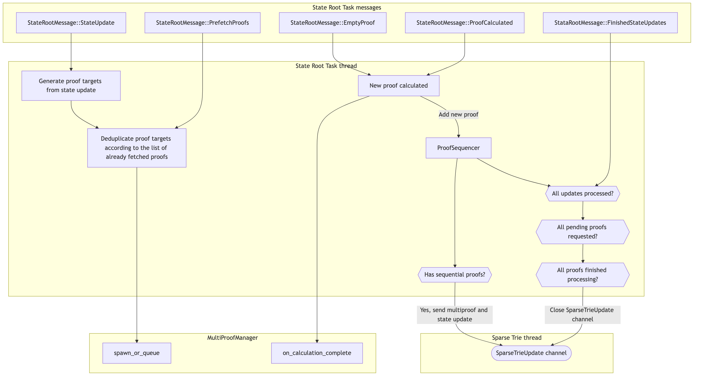
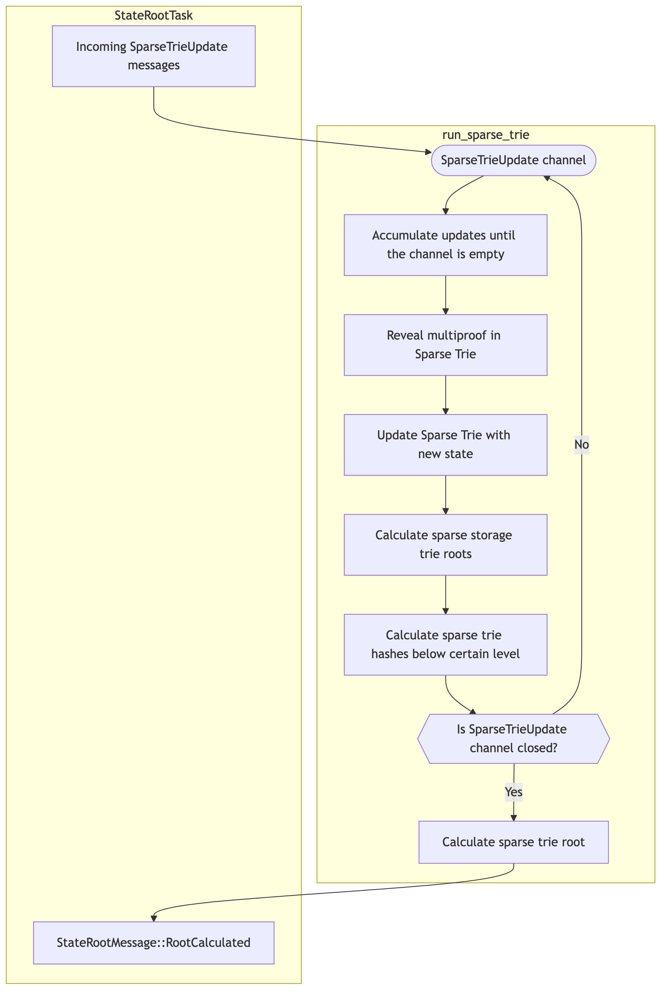

# State Root Calculation for Engine Payloads

The heart of Reth is the Engine, which is responsible for driving the chain forward.
Each time it receives a new payload ([engine_newPayloadV4](https://github.com/ethereum/execution-apis/blob/main/src/engine/prague.md#engine_newpayloadv4)
at the time of writing this document), it:
1. Does a bunch of validations.
2. Executes the block contained in the payload.
3. Calculates the [MPT](https://ethereum.org/en/developers/docs/data-structures-and-encoding/patricia-merkle-trie/)
root of the new state.
4. Compares the root with the one received in the block header.
5. Considers the block valid.

This document describes the lifecycle of a payload with the focus on state root calculation,
from the moment the payload is received, to the moment we have a new state root.

We will look at the following components:
- [Engine](#engine)
- [State Root Task](#state-root-task)
- [MultiProof Manager](#multiproof-manager)
- [Sparse Trie Task](#sparse-trie-task)

## Engine

It all starts with the `engine_newPayload` request coming from the [Consensus Client](https://ethereum.org/en/developers/docs/nodes-and-clients/#consensus-clients).

We extract the block from the payload, and eventually pass it to the `EngineApiTreeHandler::insert_block_inner`
method which executes the block and calculates the state root. 
https://github.com/paradigmxyz/reth/blob/2ba54bf1c1f38c7173838f37027315a09287c20a/crates/engine/tree/src/tree/mod.rs#L2359-L2362

Let's walk through the steps involved in the process.

First, we spawn the [State Root Task](#state-root-task) thread, which will receive the updates from
execution and calculate the state root. https://github.com/paradigmxyz/reth/blob/2ba54bf1c1f38c7173838f37027315a09287c20a/crates/engine/tree/src/tree/mod.rs#L2449-L2458

Then, we do two things with the block:
1. Start prewarming each transaction in a separate thread ("Prewarming thread" on the above diagram).
https://github.com/paradigmxyz/reth/blob/2ba54bf1c1f38c7173838f37027315a09287c20a/crates/engine/tree/src/tree/mod.rs#L2490-L2507
    - Each transaction is optimistically executed in parallel with each other on top of the previous block,
    but the results are not committed to the database.
    - All accounts and storage slots that were accessed are cached in memory, so that the actual execution
    can use them instead of going to the database.
    - All modified accounts and storage slots are sent as `StateRootMessage::PrefetchProofs`
    to the [State Root Task](#state-root-task).
    - Some transactions will fail, because they require the previous transactions to be executed first.
    It doesn't matter, because we only care about optimistically prewarming the accounts and storage slots
    that are accessed, and transactions will be executed in the correct order later anyway.
2. Execute transactions sequentially.
https://github.com/paradigmxyz/reth/blob/2ba54bf1c1f38c7173838f37027315a09287c20a/crates/engine/tree/src/tree/mod.rs#L2523
    - Transactions are executed one after another. Accounts and storage slots accessed during the execution
    are looked up in the cache from the previous prewarming step. 
    - All modified accounts and storage slots are sent as `StateRootMessage::StateUpdate`
    to the [State Root Task](#state-root-task).
    - When all transactions are executed, the `StateRootMessage::FinishedStateUpdates` is sent
    to the [State Root Task](#state-root-task).

Eventually, the Engine will receive the `StateRootMessage::RootCalculated` message from
the [State Root Task](#state-root-task) thread, and send the `engine_newPayload` response.

## State Root Task

State Root Task is a component responsible for receiving the state updates from the [Engine](#engine),
issuing requests for generating proofs to the [MultiProof Manager](#multiproof-manager),
updating the sparse trie using the [Sparse Trie Task](#sparse-trie-task),
and finally sending the state root back to the [Engine](#engine).

At its core, it's a state machine that receives messages from other components, and handles them accordingly.
https://github.com/paradigmxyz/reth/blob/2ba54bf1c1f38c7173838f37027315a09287c20a/crates/engine/tree/src/tree/root.rs#L726

When the State Root Task is spawned, it also spawns the [Sparse Trie Task](#sparse-trie-task) in a separate thread.
https://github.com/paradigmxyz/reth/blob/2ba54bf1c1f38c7173838f37027315a09287c20a/crates/engine/tree/src/tree/root.rs#L542-L544

### Generating proof targets

State root calculation in the [Sparse Trie Task](#sparse-trie-task) relies on:
1. Revealing nodes in the trie according to [MPT (Merkle Patricia Trie) proofs](https://docs.chainstack.com/docs/deep-dive-into-merkle-proofs-and-eth-getproof-ethereum-rpc-method).
    - Revealing means adding the nodes from the proof to the Sparse Trie structure.
    See [example](#revealing-example) for a diagram.
2. Updating the trie according to the state updates received from executing the transactions.

Let's look at the first two messages on the diagram: `StateRootMessage::StateUpdate`
and `StateRootMessage::PrefetchProofs`. They are sent from the previous [Engine](#engine) step,
and first used to form the proofs targets.

Proof targets are a list of accounts and storage slots that we send to
the [MultiProof Manager](#multiproof-manager) to generate the MPT proofs.
https://github.com/paradigmxyz/reth/blob/2ba54bf1c1f38c7173838f37027315a09287c20a/crates/trie/common/src/proofs.rs#L20-L21

Before sending them, we first deduplicate the list of targets according to a list of proof targets
that were already fetched.
https://github.com/paradigmxyz/reth/blob/2ba54bf1c1f38c7173838f37027315a09287c20a/crates/engine/tree/src/tree/root.rs#L1022-L1028 

This deduplication step is important, because if two transactions modify the same account or storage slot,
we only need to fetch the MPT proof once.

Then, the proof targets are passed to the [`MultiProofManager::spawn_or_queue`](#multiproof-manager) method.

### Sequencing calculated proofs

When the [MultiProof Manager](#multiproof-manager) finishes calculating the proof, it sends
a message back to the State Root Task. It can be either:
1. `StateRootMessage::EmptyProof` if the deduplication of proof targets resulted in an empty list.
2. `StateRootMessage::ProofCalculated(proof, state)` with the MPT proof calculated for the targets,
along with the state update that the proof was generated for.

On any message, we call the [`MultiProofManager::on_calculation_complete`](#multiproof-manager) method
to signal that the proof calculation is finished.

Some proofs can arrive earlier than others, even though they were requested later. It depends on the number
of proof targets, and also some non-determinism in the database caching.

The issue with this is that we need to ensure that the proofs are sent
to the [Sparse Trie Task](#sparse-trie-task) in the order that they were requested. Because of this,
we introduced a `ProofSequencer` that we add new proofs to.
https://github.com/paradigmxyz/reth/blob/2ba54bf1c1f38c7173838f37027315a09287c20a/crates/engine/tree/src/tree/root.rs#L666-L672

`ProofSequencer` acts in the following way:
1. Each proof has an associated "sequence number" that determines the original order of state updates.
2. When the proof is calculated, it's added to the `ProofSequencer` with the sequence number
and state update associated with it.
3. If the `ProofSequencer` has a consecutive sequence of proofs without gaps in sequence numbers, it returns this sequence.

Once the `ProofSequencer` returns a sequence of proofs,
we send them along with the state updates to the [Sparse Trie Task](#sparse-trie-task).

### Finishing the calculation

Once all transactions are executed, the [Engine](#engine) sends a `StateRootMessage::FinishStateUpdates` message
to the State Root Task, marking the end of receiving state updates.

Every time we receive a new proof from the [MultiProof Manager](#multiproof-manager), we also check
the following conditions:
1. Are all updates received? (`StateRootMessage::FinishStateUpdates` was sent)
2. Is `ProofSequencer` empty? (no proofs are pending for sequencing)
3. Are all proofs that were sent to the [`MultiProofManager::spawn_or_queue`](#multiproof-manager) finished
calculating and were sent to the [Sparse Trie Task](#sparse-trie-task)?

https://github.com/paradigmxyz/reth/blob/2ba54bf1c1f38c7173838f37027315a09287c20a/crates/engine/tree/src/tree/root.rs#L935-L944

When all conditions are met, we close the [State Root Task](#state-root-task) receiver channel,
signaling that no proofs or state updates are coming anymore, and the state root calculation should be finished.

## MultiProof Manager

MultiProof manager is a component responsible for generating MPT proofs
and sending them back to the [State Root Task](#state-root-task).

### Spawning new proof calculations

The entrypoint is the `spawn_or_queue` method
https://github.com/paradigmxyz/reth/blob/2ba54bf1c1f38c7173838f37027315a09287c20a/crates/engine/tree/src/tree/root.rs#L355-L357

It has the following responsibilities:
1. On empty proof targets, immediately send `StateRootMessage::EmptyProof` to the [State Root Task](#state-root-task).
2. If the number of maximum concurrent proof calculations is reached, push the proof request to the pending queue.
    - Maximum concurrency is determined as `NUM_THREADS / 2 - 2`.
    - For a system with 64 threads, the maximum number of concurrent proof calculations will be `64 / 2 - 2 = 30`.
3. If we can spawn a new proof calculation thread, spawn it using [`ParallelProof`](https://github.com/paradigmxyz/reth/blob/09a6aab9f7dc283e42fd00ce8f179542f8558580/crates/trie/parallel/src/proof.rs#L85),
and send `StateRootMessage::ProofCalculated` to the [State Root Task](#state-root-task) once it's done.

### Exhausting the pending queue

To exhaust the pending queue from the step 2 of the `spawn_or_queue` described above,
the [State Root Task](#state-root-task) calls into another method `on_calculation_complete` every time
a proof is calculated.
https://github.com/paradigmxyz/reth/blob/2ba54bf1c1f38c7173838f37027315a09287c20a/crates/engine/tree/src/tree/root.rs#L379-L387

Its main purpose is to spawn a new proof calculation thread and do the same as step 3 of the `spawn_or_queue` method
described above.

## Sparse Trie Task

Sparse Trie component is the heart of the new state root calculation logic.

### Sparse Trie primer

- The state trie of Ethereum is very big (150GB+), and we cannot realistically fit it into memory.
- What if instead of loading the entire trie in memory,
we only load the parts that were modified during the block execution (i.e. make the trie "sparse")?
    - Such modified parts will have nodes that will be modified,
    and nodes that are needed only for calculating the hashes.
    - Essentially, this is the same idea as [MPT proofs](https://docs.chainstack.com/docs/deep-dive-into-merkle-proofs-and-eth-getproof-ethereum-rpc-method)
    that have only partial information about the sibling nodes, if these nodes aren't part of the
    requested path.
- When updating the trie, we first reveal the nodes using the MPT proofs, and then add/update/remove the leaves,
along with the other nodes that need to be modified in the process of leaf update.

#### Revealing Example

1. Empty
    - Sparse Trie has no revealed nodes, and an empty root
2. `0x10010` revealed
    - Child of the root branch node under the nibble `1` is revealed, and it's an extension node placed on the path `0x1`.
    - Child of the extension node at path `0x1` with the extension key `0010` is revealed, and it's a leaf node placed on the path `0x10010`.
3. `0x00010` revealed
    - Child of the root branch node under the nibble `0` is revealed, and it's a branch node placed on the path `0x0`.
    - Child of the branch node at path `0x0` under the nibble `1` is revealed, and it's a hash node placed on the path `0x01`.
    - Child of the branch node at path `0x0` under the nibble `0` is revealed, and it's an extension placed on the path `0x00`.
    - Child of the extension node at path `0x00` with the extension key `01` is revealed, and it's a branch node placed on the path `0x0001`.
    - Child of the branch node at path `0x0001` under the nibble `1` is revealed, and it's a hash node placed on the path `0x00011`.
    - Child of the branch node at path `0x0001` under the nibble `0` is revealed, and it's a leaf node placed on the path `0x00010`.

For the implementation details, see [crates/trie/sparse/src/trie.rs](https://github.com/paradigmxyz/reth/blob/09a6aab9f7dc283e42fd00ce8f179542f8558580/crates/trie/sparse/src/trie.rs).

### Sparse Trie updates

The messages to the sparse trie are sent from the [State Root Task](#state-root-task),
and consist of the proof that needs to be revealed, and a list of updates that need to be applied.
https://github.com/paradigmxyz/reth/blob/2ba54bf1c1f38c7173838f37027315a09287c20a/crates/engine/tree/src/tree/root.rs#L66-L74

We do not reveal the proofs and apply the updates immediately,
but instead accumulate them until the messages channel is empty, and then reveal and apply in bulk.
https://github.com/paradigmxyz/reth/blob/2ba54bf1c1f38c7173838f37027315a09287c20a/crates/engine/tree/src/tree/root.rs#L991-L994

When messages are accumulated, we update the Sparse Trie:
1. Reveal the proof
https://github.com/paradigmxyz/reth/blob/2ba54bf1c1f38c7173838f37027315a09287c20a/crates/engine/tree/src/tree/root.rs#L1090-L1091
2. For each modified storage trie, apply updates and calculate the roots in parallel
https://github.com/paradigmxyz/reth/blob/2ba54bf1c1f38c7173838f37027315a09287c20a/crates/engine/tree/src/tree/root.rs#L1093
3. Update accounts trie
https://github.com/paradigmxyz/reth/blob/2ba54bf1c1f38c7173838f37027315a09287c20a/crates/engine/tree/src/tree/root.rs#L1133
4. Calculate keccak hashes of the nodes below the certain level
https://github.com/paradigmxyz/reth/blob/2ba54bf1c1f38c7173838f37027315a09287c20a/crates/engine/tree/src/tree/root.rs#L1139

As you can see, we do not calculate the state root hash of the accounts trie
(the one that will be the result of the whole task), but instead calculate only the certain hashes.

This is an optimization that comes from the fact that we will likely update the top 2-3 levels of the trie
in every transaction, so doing that work every time would be wasteful.

Instead, we calculate hashes for most of the levels of the trie, and do the rest of the work
only when we're finishing the calculation.

### Finishing the calculation

Once the messages channel is closed by the [State Root Task](#state-root-task),
we exhaust it, reveal proofs and apply updates, and then calculate the full state root hash
https://github.com/paradigmxyz/reth/blob/2ba54bf1c1f38c7173838f37027315a09287c20a/crates/engine/tree/src/tree/root.rs#L1014

This state root is eventually sent as `StateRootMessage::RootCalculated` to the [Engine](#engine).
