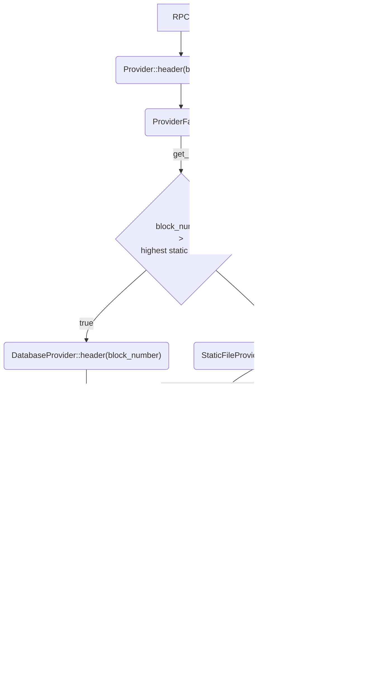

# StaticFile

## Overview

Data that has reached a finalized state and won't undergo further changes (essentially frozen) should be read without concerns of modification. This makes it unsuitable for traditional databases.

This crate aims to copy this data from the current database to multiple static files, aggregated by block ranges. At every 500_000th block, a new static file is created.

Below are four diagrams illustrating on how data is served from static files to the provider. A glossary is also provided to explain the different (linked) components involved in these processes.

### Query Diagrams ([`Provider`](../../crates/storage/provider/src/providers/database/mod.rs#L41))

  
By block number

  
By block hash

  
By transaction number

  
By transaction hash

### Glossary
In descending order of abstraction hierarchy:

[`StaticFileProducer`](../../crates/static-file/src/static_file_producer.rs#L25): A `reth` [hook](../../crates/consensus/beacon/src/engine/hooks/static_file.rs) service that when triggered, **copies** finalized data from the database to the latest static file. Upon completion, it updates the internal index at `StaticFileProvider` with the new highest block and transaction on each specific segment.

[`StaticFileProvider`](../../crates/storage/provider/src/providers/static_file/manager.rs#L44) A provider similar to `DatabaseProvider`, **managing all existing static_file files** and selecting the optimal one (by range and segment type) to fulfill a request. **A single instance is shared across all components and should be instantiated only once within `ProviderFactory`**. An immutable reference is given everytime `ProviderFactory` creates a new `DatabaseProvider`.

[`StaticFileJarProvider`](../../crates/storage/provider/src/providers/static_file/jar.rs#L42) A provider similar to `DatabaseProvider` that provides access to a **single static file segment data** one a specific block range.

[`StaticFileCursor`](../../crates/storage/db/src/static_file/cursor.rs#L11) An elevated abstraction of `NippyJarCursor` for simplified access. It associates the bitmasks with type decoding. For instance, `cursor.get_two::<TransactionMask<Tx, Signature>>(tx_number)` would yield `Tx` and `Signature`, eliminating the need to manage masks or invoke a decoder/decompressor.

[`StaticFileSegment`](../../crates/primitives/src/static_file/segment.rs#L10) Each static file only contains data of a specific segment, e.g., `Headers`, `Transactions`, or `Receipts`.

[`NippyJarCursor`](../../crates/storage/nippy-jar/src/cursor.rs#L12) Accessor of data in a `NippyJar` file. It enables queries either by row number (e.g., block number 1) or by a predefined key not part of the file (e.g., transaction hashes). **Currently, only queries by row number are being used.** If a file has multiple columns (e.g., `Header | HeaderTD | HeaderHash`), and one wishes to access only one of the column values, this can be accomplished by bitmasks. (e.g., for `HeaderTD`, the mask would be `0b010`).

[`NippyJar`](../../crates/storage/nippy-jar/src/lib.rs#92) An append-or-truncate-only file format. It supports multiple columns, compression (e.g., Zstd (with and without dictionaries), lz4, uncompressed) and inclusion filters (e.g., cuckoo filter: `is hash X part of this dataset`). StaticFiles are organized by block ranges. (e.g., `TransactionStaticFile_0_-_499_999.jar` contains a transaction per row for all transactions between block `0` and block `499_999`). For more check the struct documentation.
