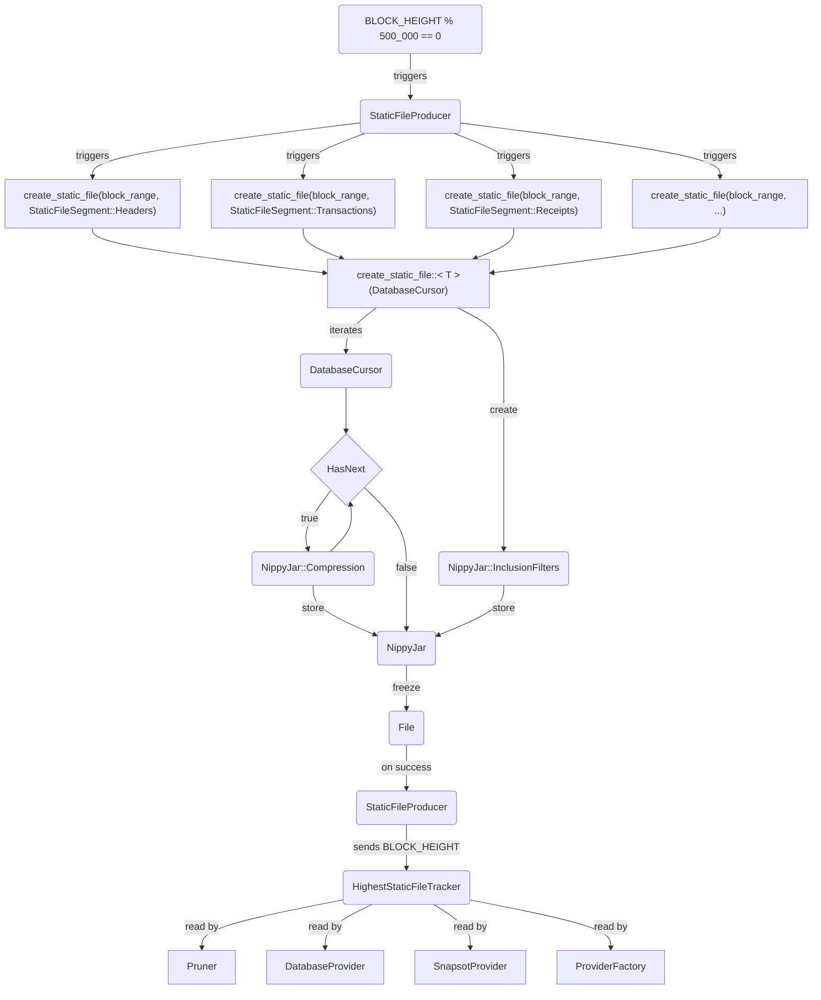

# StaticFile

## Overview

Data that has reached a finalized state and won't undergo further changes (essentially frozen) should be read without concerns of modification. This makes it unsuitable for traditional databases.

This crate aims to copy this data from the current database to multiple static files, aggregated by block ranges. At every 500_000th block new static files are created.

Below are two diagrams illustrating the processes of creating static files (custom format: `NippyJar`) and querying them. A glossary is also provided to explain the different (linked) components involved in these processes.

  
Creation diagram (<code>StaticFileProducer</code>)

  
Query diagram (<code>Provider</code>)

### Glossary
In descending order of abstraction hierarchy:

[`StaticFileProducer`](../../crates/static_file/src/static_file_producer.rs#L20): A `reth` background service that **copies** data from the database to new static-file files when the block height reaches a certain threshold (e.g., `500_000th`). Upon completion, it dispatches a notification about the higher static file block to `HighestStaticFileTracker` channel. **It DOES NOT remove data from the database.**

[`HighestStaticFileTracker`](../../crates/static_file/src/static_file_producer.rs#L22): A channel utilized by `StaticFileProducer` to announce the newest static_file block to all components with a listener: `Pruner` (to know which additional tables can be pruned) and `DatabaseProvider`  (to know which data can be queried from the static files).

[`StaticFileProvider`](../../crates/storage/provider/src/providers/static_file/manager.rs#L15) A provider similar to `DatabaseProvider`, **managing all existing static_file files** and selecting the optimal one (by range and segment type) to fulfill a request. **A single instance is shared across all components and should be instantiated only once within `ProviderFactory`**. An immutable reference is given everytime `ProviderFactory` creates a new `DatabaseProvider`.

[`StaticFileJarProvider`](../../crates/storage/provider/src/providers/static_file/jar.rs#L42) A provider similar to `DatabaseProvider` that provides access to a **single static_file file**.

[`StaticFileCursor`](../../crates/storage/db/src/static_file/cursor.rs#L12) An elevated abstraction of `NippyJarCursor` for simplified access. It associates the bitmasks with type decoding. For instance, `cursor.get_two::<TransactionMask<Tx, Signature>>(tx_number)` would yield `Tx` and `Signature`, eliminating the need to manage masks or invoke a decoder/decompressor.

[`StaticFileSegment`](../../crates/primitives/src/static_file/segment.rs#L10) Each static_file file only contains data of a specific segment, e.g., `Headers`, `Transactions`, or `Receipts`.

[`NippyJarCursor`](../../crates/storage/nippy-jar/src/cursor.rs#L12) Accessor of data in a `NippyJar` file. It enables queries either by row number (e.g., block number 1) or by a predefined key not part of the file (e.g., transaction hashes). If a file has multiple columns (e.g., `Tx | TxSender | Signature`), and one wishes to access only one of the column values, this can be accomplished by bitmasks. (e.g., for `TxSender`, the mask would be `0b010`).

[`NippyJar`](../../crates/storage/nippy-jar/src/lib.rs#57) A create-only file format. No data can be appended after creation. It supports multiple columns, compression (e.g., Zstd (with and without dictionaries), lz4, uncompressed) and inclusion filters (e.g., cuckoo filter: `is hash X part of this dataset`). StaticFiles are organized by block ranges. (e.g., `TransactionStaticFile_499_999.jar` contains a transaction per row for all transactions from block `0` to block `499_999`). For more check the struct documentation.
