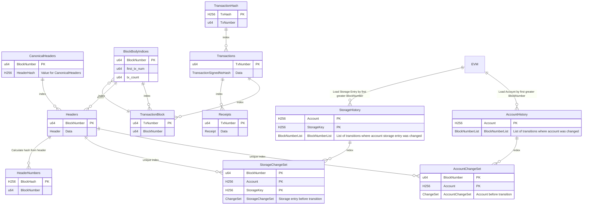

# Database

## Abstractions

* We created a [Database trait abstraction](https://github.com/paradigmxyz/reth/blob/0d9b9a392d4196793736522f3fc2ac804991b45d/crates/interfaces/src/db/mod.rs) using Rust Stable GATs which frees us from being bound to a single database implementation. We currently use MDBX, but are exploring [redb](https://github.com/cberner/redb) as an alternative.
* We then iterated on [`Transaction`](https://github.com/paradigmxyz/reth/blob/0d9b9a392d4196793736522f3fc2ac804991b45d/crates/stages/src/db.rs#L14-L19) as a non-leaky abstraction with helpers for strictly-typed and unit-tested higher-level database abstractions.

## Codecs

* We want Reth's serialized format to be able to trade off read/write speed for size, depending on who the user is.
* To achieve that, we created the [Encode/Decode/Compress/Decompress traits](https://github.com/paradigmxyz/reth/blob/0d9b9a392d4196793736522f3fc2ac804991b45d/crates/interfaces/src/db/table.rs#L9-L36) to make the (de)serialization of database `Table::Key` and `Table::Values` generic.
    * This allows for [out-of-the-box benchmarking](https://github.com/paradigmxyz/reth/blob/0d9b9a392d4196793736522f3fc2ac804991b45d/crates/db/benches/encoding_iai.rs#L5) (using [Criterion](https://github.com/bheisler/criterion.rs) and [Iai](https://github.com/bheisler/iai))
    * It also enables [out-of-the-box fuzzing](https://github.com/paradigmxyz/reth/blob/0d9b9a392d4196793736522f3fc2ac804991b45d/crates/interfaces/src/db/codecs/fuzz/mod.rs) using [trailofbits/test-fuzz](https://github.com/trailofbits/test-fuzz).
* We implemented that trait for the following encoding formats:
    * [Ethereum-specific Compact Encoding](https://github.com/paradigmxyz/reth/blob/0d9b9a392d4196793736522f3fc2ac804991b45d/crates/codecs/derive/src/compact/mod.rs): A lot of Ethereum datatypes have unnecessary zeros when serialized, or optional (e.g. on empty hashes) which would be nice not to pay in storage costs.
        * [Erigon](https://github.com/ledgerwatch/erigon/blob/12ee33a492f5d240458822d052820d9998653a63/docs/programmers_guide/db_walkthrough.MD) achieves that by having a `bitfield` set on  Table "PlainState which adds a bitfield to Accounts.
        * Akula expanded it for other tables and datatypes manually. It also saved some more space by storing the length of certain types (U256, u64) using the modular_bitfield crate, which compacts this information.
        * We generalized it for all types, by writing a derive macro that autogenerates code for implementing the trait. It, also generates the interfaces required for fuzzing using ToB/test-fuzz:
    * [Scale Encoding](https://github.com/paritytech/parity-scale-codec)
    * [Postcard Encoding](https://github.com/jamesmunns/postcard)
    * Passthrough (called `no_codec` in the codebase)
* We made implementation of these traits easy via a derive macro called [`main_codec`](https://github.com/paradigmxyz/reth/blob/0d9b9a392d4196793736522f3fc2ac804991b45d/crates/codecs/derive/src/lib.rs#L15) that delegates to one of Compact (default), Scale, Postcard or Passthrough encoding. This is [derived on every struct we need](https://github.com/search?q=repo%3Aparadigmxyz%2Freth%20%22%23%5Bmain_codec%5D%22&type=code), and lets us experiment with different encoding formats without having to modify the entire codebase each time.

# Table design

Historical state changes are indexed by `BlockNumber`. This means that `reth` stores the state for every account after every block that touched it, and it provides indexes for accessing that data quickly. While this may make the database size bigger (needs benchmark once `reth` is closer to prod).

Below, you can see the table design that implements this scheme:

