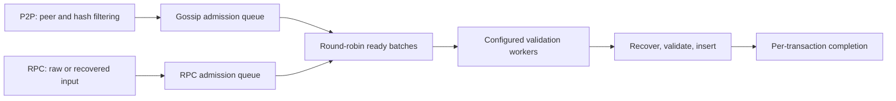

# Shared transaction ingress

`Pool::transaction_ingress()` provides bounded admission before sender recovery for RPC and P2P. The standard pool initializes one scheduler shared by all handles. Custom pools can provide their own service or return `None` to retain the existing adapter paths.

Each source has its own transaction-count and estimated-byte budget. Reservations cover queued requests, executing jobs, and recovered RPC transactions awaiting forwarding or sidecar conversion. Canceling a caller does not release capacity still owned by a running worker. The worker skips canceled requests before recovery, and completed requests release their reservation after insertion.

The scheduler takes already available requests without waiting to fill a batch. Batches may cross P2P message boundaries and are bounded by count and estimated bytes; an input larger than the byte quantum runs alone. Ready source queues alternate. There are at most as many dispatched batches as configured validation workers. Recovery is sequential within a batch, and batches execute concurrently on those workers; the standard P2P path does not use the global Rayon pool.

The service owns the optional `SenderRecoveryCache` shared with payload execution. Both raw RPC decoding and pooled P2P recovery use the transaction type's checked recovery hooks. Successful recovery is cached immediately, before state validation or insertion; rejected admission does not erase that cryptographic result. Failed recovery is never cached. Legacy and typed transactions use the same hash-keyed cache, while chain-ID and fork validation remain separate. Caching remains opt-in through `--engine.sender-recovery-cache`; simultaneous cache misses are not deduplicated. State validation starts after recovery, so a batch does not hold a state provider while doing cryptographic work. Insertion and result delivery stay on the worker, avoiding insertion work in the transaction manager's poll or RPC runtime. Existing synchronous validators use a bounded blocking wrapper; executor-backed pools dispatch the complete job to their validation tasks.

RPC preserves the submission origin, raw subscription notifications, forwarding result, and blob-sidecar conversion behavior. Asynchronous preparation releases the worker while retaining the original admission permit. P2P retains peer attribution and result handling independently of message boundaries. Shared-service admission failures do not enter the bad-transaction cache or penalize peers; the fetcher retains a bounded retry opportunity. The existing broadcast import limit may still truncate broadcasts; fetched responses pause at their soft limit. The manager polls newly admitted completions before sleeping so worker completion can wake a paused fetcher. Completions have a transaction-sized polling budget, avoiding artificial backpressure from counting finished imports as pending.

## Payload priority and lifecycle

`TransactionIngress::pause_handle()` exposes a cloneable `TaskPause`. Every producer obtains an owned guard while doing foreground work. A watch channel holds the active-producer count, and ingress resumes only when the final guard drops. Cancellation and unwinding drop guards normally. Watch subscription rechecks the current count, avoiding a lost wakeup between checking and waiting. The basic engine validator holds a guard during live block/payload validation, including downloaded blocks; staged historical sync does not hold one. Other producers can use the same handle without changing ingress scheduling.

The scheduler stops dispatching while paused. Workers check between individual recoveries, before a bounded validation batch, and before batched insertion. An already-running recovery, validation batch, or insertion finishes its current unit; this is not crypto preemption or a hard CPU deadline. State providers are opened after recovery and the pause check. Admission permits stay owned throughout pauses and asynchronous RPC preparation. Dropping all ingress handles also wakes paused jobs so they release their permits and responses. RPC recovery notifications retain only the notification sender, avoiding a pool/queued-callback ownership cycle.

Recovery, validation and insertion remain on the same worker. Draining a separate recovery-completion queue could combine completions from different workers, but adds a scheduling hop, intermediate ownership and another queue. The existing ready-batch scheduler already coalesces independent arrivals without a timer, and same-worker insertion preserves low-load latency and amortizes the pool lock. There is no additional recovery scheduler, per-transaction CPU task, or unbounded admitted completion queue. OS thread priority is unchanged; bounded worker count and explicit cooperative pauses control ingress CPU work.

## Configuration and limits

- `--txpool.max-batch-size` controls shared recovery/validation/insertion batches; its default is 32.
- `--txpool.additional-validation-tasks` continues to control worker count (one base worker plus the configured additional tasks).
- `PoolConfig::ingress` also configures per-source admission counts and bytes, and the byte quantum. Defaults are 4,096 transactions and 32 MiB per source, with a 256 KiB batch quantum.
- `EthApiBuilder::max_batch_size` remains the setting for the fallback RPC processor. Shared pools own their batch settings.
- The admission byte limit accounts for input estimates, including growth during recovery/conversion. It is not a bound on all allocator, RPC transport, or downstream cache memory.

Resident pool capacity is separate from ingress capacity. A full pool can still accept a higher-priority transaction or replacement, so resident fullness does not cause blanket pre-recovery rejection. Existing pool eviction and validation rules remain authoritative. Existing recovered-transaction pool APIs also remain available for internal callers.

A smaller worker budget limits total ingress CPU, including recovery and insertion. Under overload this can trade gossip admission throughput for RPC responsiveness and CPU available to chain processing. Raising validation concurrency gives recovery more CPU as well. It does not remove pool write-lock contention or the cost of long per-account nonce chains. Count and byte quanta are not CPU deadlines: blob verification and chain-specific authorization work can require different settings. The measurements below cover Ethereum transfers, not Tempo AA transactions or production persistence/TLB behavior.

## Measurements

Compared with main `4dd0cc021a72` on a Linux AMD EPYC 4585PX host, using identical profiling builds, eight physical cores (16 logical CPUs) for the node and separate CPUs for generators. Four validation workers and a 32-transaction batch limit were used on both builds. The node and generators shared a 3 GiB cgroup; existing nodes remained running. These are local comparisons, not production capacity estimates.

Each case offered 20,000 RPC transfers at up to 5,000/s, with 256 concurrent requests and no retries. Mixed cases also offered 100,000 P2P transfers at 25,000/s, using either broadcasts or fetched bodies in 256-transaction messages. Account and resident-pool limits were raised to stress long nonce chains. Non-replay cases used a development chain with 500 ms blocks. Replay cases imported the same 45 payloads containing 62,748 P2P-source transactions while RPC used disjoint senders, avoiding nonce invalidation by the replay. The first three payloads were warmup; the remaining 40 nonempty payloads supply latency samples. At this sample count, p99 is the maximum, so tail estimates are noisy.

Medians of three runs per case and build, with alternating build order; values are main → candidate. Every run acknowledged all 20,000 RPC submissions successfully. CPU is node-wide user plus system time, excluding generators. CPU per insertion also includes payload work and is not an isolated recovery cost. Insertions measure accepted pool work, not retention or inclusion.

| Workload | Sender cache | CPU µs/insertion | Pool insertions | RPC p99 (ms) | newPayload p95 / p99 (ms) |
|---|---|---:|---:|---:|---:|
| RPC only | Off | 167.0 → 162.5 | 20,000 → 20,000 | 0.353 → 0.336 | — |
| Fetched | On | 121.3 → 117.2 | 93,984 → 92,206 | 15.725 → 11.624 | — |
| Fetched + payload replay | Off | 125.8 → 118.5 | 111,100 → 109,483 | 10.481 → 13.628 | 9.844 / 14.495 → 9.182 / 9.870 |
| Fetched + payload replay | On | 109.9 → 103.9 | 111,356 → 109,456 | 10.781 → 13.513 | 6.649 / 7.060 → 5.981 / 6.157 |
| Broadcast + payload replay | On | 111.8 → 97.9 | 112,636 → 112,124 | 28.017 → 11.289 | 6.559 / 10.546 → 6.008 / 6.683 |

Payload priority trades fetched-RPC tail latency and some gossip admission for lower payload tails and CPU per insertion. RPC-only p50 also rose from 0.123 to 0.135 ms. The cache-on/off comparison includes existing P2P cache behavior and does not isolate the benefit of RPC cache sharing; cache hit rate was not measured. The node-level regression test verifies that rejected raw RPC transactions publish successful recovery to the same cache used by payload execution.

Both ingress lanes recorded zero admission rejections, but upstream gossip limits still dropped offered work. In mixed candidate runs, median sampled outstanding RPC work peaked at 10 requests, versus roughly 3,900–4,032 P2P requests against the 4,096 budget. Mean batches contained 2.0–2.2 RPC and 28.1–29.3 P2P transactions. P2P enqueue-to-recovery p99 was 215–341 ms; this is queue delay, not end-to-end arrival-to-pool latency. Gauges sampled every 200 ms can miss shorter peaks.

An initial replay corpus included RPC senders and invalidated RPC nonces as payloads arrived. Those runs are retained separately in the benchmark evidence and excluded from this comparison. The corrected matrix uses disjoint RPC and replay senders.

The [original measurements](https://github.com/paradigmxyz/reth/blob/119cdd43f236bbf0845fcf6880e9980cdbac88a6/docs/design/transaction-ingress.md#measurements) include batch-size selection, singleton broadcasts, burst overload, constrained pool capacity and separate CPU profiles. Singleton broadcasts regressed, and burst overload shed substantially more gossip; those cases were not rerun for the cache/pause changes. Ready batching and bounded concurrency do not guarantee faster ingestion for every workload, and repeated sender-prefix traversal and pool write-lock contention remain separate costs.
