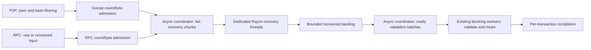

# Shared transaction ingress

`BatchTxProcessor` provides bounded admission, recovery and batch insertion above the transaction pool. Node construction creates one processor and explicitly passes its `BatchTxHandle` to RPC and the P2P transaction manager. The engine receives its pause handle through the node components. `TransactionPool`, `PoolConfig` and the pool itself have no ingress service or scheduler ownership.

This extends the existing transaction batcher with a bounded staged pipeline. One async coordinator dispatches sender recovery to a dedicated Rayon pool, re-batches recovered transactions, and dispatches validation plus insertion to the existing blocking validation workers. `TransactionValidator` needs no ingress-specific hooks. Custom pools use their existing insertion APIs through bounded blocking jobs. Standalone RPC instances construct the same processor when no shared handle is supplied.

Each source has its own transaction-count and estimated-byte budget. Admission uses nonblocking reservations and rejects immediately when either limit is exhausted. Reservations cover queued requests, executing jobs, and recovered RPC transactions awaiting forwarding or sidecar conversion. Canceling a caller does not release capacity still owned by a running worker. The worker skips canceled requests before recovery or validation, and completed requests release their reservation after insertion.

Recovery concurrency is configured independently with `--txpool.recovery-threads` (default: half the available CPUs, at least one); `--txpool.recovery-batch-size` controls recovery chunks (default 32). The Rayon pool is created on first unrecovered input and never has more outstanding jobs than threads, including jobs waiting to start and completed results. Already recovered input bypasses Rayon. Validation concurrency remains the configured validation-worker count, and `--txpool.max-batch-size` controls import batches (default 32). Both stages alternate RPC and P2P queues and dispatch available work immediately without a batching timer. Import batches can combine results from different recovery chunks. No response-ID map or global ordering buffer is needed: each transaction carries its origin, reply sender and admission permit through the pipeline.

Before recovery dispatch, each transaction also reserves one of `BatchTxConfig::max_recovered_transactions` slots (default 1024). This budget covers running recovery, completed recovery results, the recovered backlog, and queued/running imports. Stalled validation therefore stops recovery dispatch before filling the end-to-end admission budget. The existing per-source byte reservations also cover this entire intermediate stage, so both transaction count and retained estimated bytes are bounded. Each batch has an estimated-byte quantum; a larger admitted transaction runs alone.

The service owns the optional `SenderRecoveryCache` shared with payload execution. Both raw RPC decoding and pooled P2P recovery use the transaction type's checked recovery hooks. Successful recovery is cached immediately, before state validation or insertion; rejected admission does not erase that cryptographic result. Failed recovery is never cached. Legacy and typed transactions use the same hash-keyed cache, while chain-ID and fork validation remain separate. Caching remains opt-in through `--engine.sender-recovery-cache`; simultaneous cache misses are not deduplicated. State validation starts after recovery, so a batch does not hold a state provider while doing cryptographic work. Insertion and result delivery stay on the worker, avoiding insertion work in the transaction manager's poll or RPC runtime. The generic pool adapter submits recovered batches through bounded blocking jobs; the validation-worker adapter validates and inserts each recovered batch on an existing validation task. Database I/O and validation work, including blob proof checks, never run on the recovery pool.

RPC preserves the submission origin, raw subscription notifications, forwarding result, and blob-sidecar conversion behavior. Asynchronous preparation releases the worker while retaining the original admission permit. P2P retains peer attribution and result handling independently of message boundaries. Shared-service admission failures drop the transaction without entering the bad-transaction cache, penalizing peers or scheduling a refetch. Broadcasts truncate to the manager's remaining import capacity. Shared ingress continues draining completed fetch responses while full and drops excess bodies, so a long payload pause does not retain them in response channels. The manager polls newly admitted completions before sleeping so worker completion can wake the manager. Completions have a transaction-sized polling budget, avoiding artificial backpressure from counting finished imports as pending.

## Payload priority and lifecycle

`BatchTxHandle::pause_handle()` exposes a cloneable `TransactionIngressPause`, a typed wrapper around `TaskPause` identifying the coordination between payload validation and the RPC/P2P batcher. Every producer obtains an owned guard while doing foreground work. A watch channel holds the active-producer count, and ingress resumes only when the final guard drops. Cancellation and unwinding drop guards normally. Watch subscription rechecks the current count, avoiding a lost wakeup between checking and waiting. The basic engine validator holds a guard during live block/payload validation, including downloaded blocks; staged historical sync does not hold one. Other producers can use the same handle without changing ingress scheduling.

The coordinator stops dispatching while paused but continues polling both stages' completion handles. Recovery workers check between transactions, including before starting a queued job, and return unfinished inputs to the coordinator. Validation jobs check when a worker receives them and return the batch if paused. Workers never wait for a pause or downstream queue capacity. An already-running recovery finishes its current transaction; an already-running validation/insertion job finishes its bounded batch. This is cooperative scheduling rather than crypto preemption or a hard CPU deadline.

Admission and intermediate-stage reservations stay owned throughout pauses. Dropping all batcher handles wakes the coordinator and releases queued work; already-running work owns its reservations until it ends. Panicking recovery/import jobs release their inputs and close the associated replies without stranding capacity. RPC recovery notifications retain only the notification sender, avoiding a pool/queued-callback ownership cycle.

## Backpressure and retained memory

Every new entry point reserves capacity before queueing: pooled P2P, raw RPC, already-recovered RPC and adapter preparation. Permits cover queued and executing jobs, paused jobs and asynchronous preparation. The scheduler's internal channels are unbounded Tokio channels, but private enqueueing requires an owned count/byte permit; there is no unbounded queue of admission waiters. Recovery and validation each have an independent bound on dispatched jobs, including queued jobs and completion buffers. Results carrying a recovered transaction also carry its permit.

`PoolTransaction::ingress_size()` includes attached blob sidecars, which the Ethereum pool's resident-size estimate deliberately excludes. Raw RPC admission reserves the encoding plus an initial decoded-size estimate before dispatch; recovered-size growth is checked before publishing to the next stage. RPC accounting also includes retained raw bytes. Sidecar upcasting reserves additional proof storage before conversion, and forwarding reserves hex-encoding storage before allocation or an external await. Growth is nonblocking: insufficient room rejects the operation, and dropping the input releases its previous reservation. Canceled preparation retains its permit until its detached work finishes; the converter separately limits active conversions to five. Custom transaction types must include all retained sidecars in their ingress-size estimate.

The manager retains import-count reservations until completion futures are consumed, so worker completion cannot let undrained results accumulate without a bound. Its soft limit permits at most one additional bounded fetch response (255 extra transactions); ingress's independent count and byte limits still apply. Peer attribution is capped at eight identities per pending transaction, including across peer churn during long pauses. Dropped ingress transactions do not create retry storage or reset fetch-attempt limits.

These are bounds on admitted work, not a process RSS ceiling. Existing network message/decode limits and the separate transaction-event channel budget remain in effect before ingress admission. The latter defaults to 1 GiB and drops new events at capacity. Outstanding fetch requests are count-bounded (130 globally and one per peer by default), responses are verified against at most 256 requested hashes, and completed responses are drained even while shared ingress is full. Transport buffers, allocator overhead, transient decoding/conversion scratch space, subscription buffers, the sender cache and resident-pool/blob storage have separate limits; they are not included in the two 32 MiB ingress budgets. Independently constructed network managers can omit the batcher and retain their existing recovery path and limits; node construction explicitly injects it, including for custom pools.

## Configuration and limits

- `--txpool.max-batch-size` controls shared recovery/validation/insertion batches; its default is 32.
- `--txpool.additional-validation-tasks` continues to control worker count (one base worker plus the configured additional tasks).
- `BatchTxConfig` configures per-source admission counts and bytes, and the byte quantum. Defaults are 4,096 transactions and 32 MiB per source, with a 256 KiB batch quantum.
- `EthApiBuilder::max_batch_size` controls a standalone RPC processor. An injected shared batcher owns its batch settings; `PoolBuilder::build_batcher` selects the execution adapter and can customize its configuration.
- The admission byte limit accounts for input estimates, including growth during recovery/conversion. It is not a bound on all allocator, RPC transport, or downstream cache memory.

Resident pool capacity is separate from ingress capacity. A full pool can still accept a higher-priority transaction or replacement, so resident fullness does not cause blanket pre-recovery rejection. Existing pool eviction and validation rules remain authoritative. Existing recovered-transaction pool APIs also remain available for internal callers.

A smaller worker budget limits total ingress CPU, including recovery and insertion. Under overload this can trade gossip admission throughput for RPC responsiveness and CPU available to chain processing. Raising validation concurrency gives recovery more CPU as well. It does not remove pool write-lock contention or the cost of long per-account nonce chains. Count and byte quanta are not CPU deadlines: blob verification and chain-specific authorization work can require different settings. The measurements below cover Ethereum transfers, not Tempo AA transactions or production persistence/TLB behavior.

## Measurements

Measured at `da7f499de8`, before the subsequent sidecar-accounting, overload-drop hardening and batcher consolidation. Compared with main `4dd0cc021a72` on a Linux AMD EPYC 4585PX host, using identical profiling builds, eight physical cores (16 logical CPUs) for the node and separate CPUs for generators. Four validation workers and a 32-transaction batch limit were used on both builds. The node and generators shared a 3 GiB cgroup; existing nodes remained running. These are local comparisons, not production capacity estimates.

Each case offered 20,000 RPC transfers at up to 5,000/s, with 256 concurrent requests and no retries. Mixed cases also offered 100,000 P2P transfers at 25,000/s, using either broadcasts or fetched bodies in 256-transaction messages. Account and resident-pool limits were raised to stress long nonce chains. Non-replay cases used a development chain with 500 ms blocks. Replay cases imported the same 45 payloads containing 62,748 P2P-source transactions while RPC used disjoint senders, avoiding nonce invalidation by the replay. The first three payloads were warmup; the remaining 40 nonempty payloads supply latency samples. At this sample count, p99 is the maximum, so tail estimates are noisy.

Medians of three runs per case and build, with alternating build order; values are main → candidate. Every run acknowledged all 20,000 RPC submissions successfully. CPU is node-wide user plus system time, excluding generators. CPU per insertion also includes payload work and is not an isolated recovery cost. Insertions measure accepted pool work, not retention or inclusion.

| Workload | Sender cache | CPU µs/insertion | Pool insertions | RPC p99 (ms) | newPayload p95 / p99 (ms) |
|---|---|---:|---:|---:|---:|
| RPC only | Off | 167.0 → 162.5 | 20,000 → 20,000 | 0.353 → 0.336 | — |
| Fetched | On | 121.3 → 117.2 | 93,984 → 92,206 | 15.725 → 11.624 | — |
| Fetched + payload replay | Off | 125.8 → 118.5 | 111,100 → 109,483 | 10.481 → 13.628 | 9.844 / 14.495 → 9.182 / 9.870 |
| Fetched + payload replay | On | 109.9 → 103.9 | 111,356 → 109,456 | 10.781 → 13.513 | 6.649 / 7.060 → 5.981 / 6.157 |
| Broadcast + payload replay | On | 111.8 → 97.9 | 112,636 → 112,124 | 28.017 → 11.289 | 6.559 / 10.546 → 6.008 / 6.683 |

Payload priority trades fetched-RPC tail latency and some gossip admission for lower payload tails and CPU per insertion. RPC-only p50 also rose from 0.123 to 0.135 ms. The cache-on/off comparison includes existing P2P cache behavior and does not isolate the benefit of RPC cache sharing; cache hit rate was not measured. The node-level regression test verifies that rejected raw RPC transactions publish successful recovery to the same cache used by payload execution.

Both ingress lanes recorded zero admission rejections, but upstream gossip limits still dropped offered work. In mixed candidate runs, median sampled outstanding RPC work peaked at 10 requests, versus roughly 3,900–4,032 P2P requests against the 4,096 budget. Mean batches contained 2.0–2.2 RPC and 28.1–29.3 P2P transactions. P2P enqueue-to-recovery p99 was 215–341 ms; this is queue delay, not end-to-end arrival-to-pool latency. Gauges sampled every 200 ms can miss shorter peaks.

An initial replay corpus included RPC senders and invalidated RPC nonces as payloads arrived. Those runs are retained separately in the benchmark evidence and excluded from this comparison. The corrected matrix uses disjoint RPC and replay senders.

The [original measurements](https://github.com/paradigmxyz/reth/blob/119cdd43f236bbf0845fcf6880e9980cdbac88a6/docs/design/transaction-ingress.md#measurements) include batch-size selection, singleton broadcasts, burst overload, constrained pool capacity and separate CPU profiles. Singleton broadcasts regressed, and burst overload shed substantially more gossip; those cases were not rerun for the cache/pause changes. Ready batching and bounded concurrency do not guarantee faster ingestion for every workload, and repeated sender-prefix traversal and pool write-lock contention remain separate costs.
