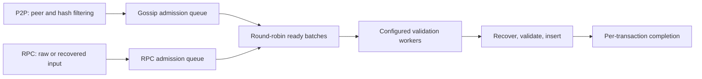

# Shared transaction ingress

`Pool::transaction_ingress()` provides bounded admission before sender recovery for RPC and P2P. The standard pool initializes one scheduler shared by all handles. Custom pools can provide their own service or return `None` to retain the existing adapter paths.

Each source has its own transaction-count and estimated-byte budget. Reservations cover queued requests, executing jobs, and recovered RPC transactions awaiting forwarding or sidecar conversion. Canceling a caller does not release capacity still owned by a running worker. The worker skips canceled requests before recovery, and completed requests release their reservation after insertion.

The scheduler takes already available requests without waiting to fill a batch. Batches may cross P2P message boundaries and are bounded by count and estimated bytes; an input larger than the byte quantum runs alone. Ready source queues alternate. There are at most as many dispatched batches as configured validation workers. Recovery is sequential within a batch, and batches execute concurrently on those workers; the standard P2P path does not use the global Rayon pool.

Recovery uses the transaction type's existing raw, pooled, and sender-cache hooks. State validation starts after recovery, so a batch does not hold a state provider while doing cryptographic work. Insertion and result delivery stay on the worker, avoiding insertion work in the transaction manager's poll or RPC runtime. Existing synchronous validators use a bounded blocking wrapper; executor-backed pools dispatch the complete job to their validation tasks.

RPC preserves the submission origin, raw subscription notifications, forwarding result, and blob-sidecar conversion behavior. Asynchronous preparation releases the worker while retaining the original admission permit. P2P retains peer attribution and result handling independently of message boundaries. Shared-service admission failures do not enter the bad-transaction cache or penalize peers; the fetcher retains a bounded retry opportunity. The existing broadcast import limit may still truncate broadcasts; fetched responses pause at their soft limit. The manager polls newly admitted completions before sleeping so worker completion can wake a paused fetcher. Completions have a transaction-sized polling budget, avoiding artificial backpressure from counting finished imports as pending.

## Configuration and limits

- `--txpool.max-batch-size` controls shared recovery/validation/insertion batches; its default is 32.
- `--txpool.additional-validation-tasks` continues to control worker count (one base worker plus the configured additional tasks).
- `PoolConfig::ingress` also configures per-source admission counts and bytes, and the byte quantum. Defaults are 4,096 transactions and 32 MiB per source, with a 256 KiB batch quantum.
- `EthApiBuilder::max_batch_size` remains the setting for the fallback RPC processor. Shared pools own their batch settings.
- The admission byte limit accounts for input estimates, including growth during recovery/conversion. It is not a bound on all allocator, RPC transport, or downstream cache memory.

Resident pool capacity is separate from ingress capacity. A full pool can still accept a higher-priority transaction or replacement, so resident fullness does not cause blanket pre-recovery rejection. Existing pool eviction and validation rules remain authoritative. Existing recovered-transaction pool APIs also remain available for internal callers.

A smaller worker budget limits total ingress CPU, including recovery and insertion. Under overload this can trade gossip admission throughput for RPC responsiveness and CPU available to chain processing. Raising validation concurrency gives recovery more CPU as well. It does not remove pool write-lock contention or the cost of long per-account nonce chains. Count and byte quanta are not CPU deadlines: blob verification and chain-specific authorization work can require different settings. The measurements below cover Ethereum transfers, not Tempo AA transactions or production persistence/TLB behavior.

## Measurements

Benchmarked against `423f173685` on a Linux AMD EPYC 4585PX host. Baseline and candidate used identical profiling builds, 8 physical cores / 16 logical CPUs of affinity, separate CPUs for the generators, and the same explicit batch and worker settings. Other existing nodes remained running; results are paired local measurements, not production capacity estimates.

Each run started a fresh loopback-only development chain with 500 ms blocks. Offline txgen fixtures contained 100,000 P2P transfers and 20,000 RPC transfers, signed by separate sets of ten funded accounts. Fees were 100 gwei. RPC submission concurrency was capped at 256 with no retries; the reported RPC rate is an offered cap, not an achieved throughput claim. P2P used either `Transactions` broadcasts or hash announcements followed by `GetPooledTransactions` responses. Announcements and standard broadcasts contained 256 transactions; separate spot checks used singleton broadcasts. The load peer served requested bodies from the same offline fixture. The observation window included at least ten seconds after the offered P2P stream.

Normal cases raised account and resident-pool limits to retain long nonce chains. This intentionally stresses insertion as well as recovery. The pool-capacity case reduced pending and queued limits to 1,024 each, while preserving existing local-transaction policy. Block inclusion is bounded by the development chain's gas limit and is not a measure of maximum chain throughput.

CPU is process-wide user plus system time from `/proc/<pid>/stat`, including exited threads and excluding generators. Pool insertions, gossip capacity drops, RPC success/failure counts, and RPC latency were recorded together, so shedding work cannot be mistaken for an efficiency gain. The main comparisons use medians of three runs with reversed variant order on alternating trials. Singleton and constrained-pool cases are one paired spot check each. CPU profiles were collected in separate runs and excluded from timing results. All runs used a 2 GiB cgroup memory cap shared by the node and generators; page-cache reclaim can affect these measurements.

Medians with a 64-transaction quantum; values are baseline → candidate. Every main-matrix run acknowledged all 20,000 RPC submissions successfully.

| P2P workload | Workers | Node CPU seconds | Pool insertions | RPC p99 (ms) |
|---|---:|---:|---:|---:|
| Fetched, 25k announced/s | 2 | 11.89 → 10.64 | 93,888 → 90,528 | 15.810 → 11.550 |
| Fetched, 25k announced/s | 4 | 11.85 → 11.11 | 94,240 → 94,496 | 15.732 → 18.044 |
| Broadcast, 25k/s | 2 | 13.33 → 10.09 | 108,992 → 94,768 | 99.789 → 9.364 |
| Broadcast, 25k/s | 4 | 13.12 → 11.09 | 106,784 → 96,640 | 92.338 → 17.336 |
| Broadcast burst, 100k/s | 4 | 10.27 → 6.79 | 103,456 → 68,220 | 48.892 → 7.066 |
| RPC only | 2 | 3.26 → 2.97 | 20,000 → 20,000 | 0.458 → 0.543 |

The clearest improvement is RPC tail latency during broadcast overload. The CPU reduction is partly reduced admitted gossip work, especially in the 100k/s burst, and must not be treated as an equal-work speedup. Burst block inclusion also fell from a median 37,408 to 35,356 transactions; dropped early nonces can strand later accepted transactions. The ordinary 25k/s cases included 46,624 transactions on both builds, and RPC-only cases included all 20,000.

The fetched path is less dramatic: two workers reduced CPU and RPC p99 while fetching fewer transactions; four workers retained similar insertion counts with lower CPU but worse RPC p99 at this quantum. The fetcher’s bounded announcement queue can drop offered hashes before requesting bodies, so zero ingress-capacity drops does not mean all announced transactions were imported. RPC-only p50 increased from 0.137 to 0.204 ms; offloading raw recovery has a small low-load scheduling cost.

### Selected batch size

A subsequent paired 32/64 sweep reduced the candidate’s RPC p99 from 9.76 to 4.87 ms with two workers on broadcast traffic, and from 17.81 to 8.91 ms with four workers on fetched traffic. Smaller jobs give RPC more opportunities between recovery and insertion work. They can increase scheduling overhead and reduce admitted gossip; this is a latency-oriented default, not a universal throughput optimum.

The default is therefore 32. A separate matched baseline/candidate confirmation used 32 on both builds. These are **single paired runs**, not the three-run medians above; values are baseline → candidate. All 20,000 RPC submissions succeeded in every confirmation run.

| P2P workload | Workers | Node CPU seconds | Pool insertions | RPC p99 (ms) |
|---|---:|---:|---:|---:|
| Fetched, 25k announced/s | 2 | 11.88 → 10.65 | 94,240 → 90,272 | 15.643 → 6.239 |
| Fetched, 25k announced/s | 4 | 11.98 → 11.56 | 94,144 → 92,124 | 16.119 → 9.193 |
| Broadcast, 25k/s | 2 | 13.37 → 10.12 | 109,856 → 94,528 | 92.827 → 5.054 |
| Broadcast, 25k/s | 4 | 13.69 → 10.97 | 110,784 → 94,880 | 110.538 → 9.552 |
| Broadcast burst, 100k/s | 4 | 9.75 → 6.84 | 105,664 → 66,793 | 43.647 → 3.931 |
| Singleton broadcasts, 25k/s | 4 | 16.48 → 17.99 | 120,000 → 120,000 | 3.673 → 9.182 |
| RPC only | 2 | 3.20 → 3.03 | 20,000 → 20,000 | 0.418 → 0.548 |

At the selected setting, two-worker broadcast RPC p50 increased from 0.160 to 0.942 ms despite the lower p99. RPC-only p50 increased from 0.130 to 0.205 ms. The default favors bounded recovery and tail responsiveness; it does not improve every latency percentile.

Singleton traffic remains an unfavorable case in this full-node workload: four workers retained all 120,000 transactions, but CPU and RPC p99 increased. With two workers and a 64-item quantum, the separate spot check retained 94,048 versus 120,000 insertions. The worker budget should be chosen for the node’s desired CPU allocation; ready batching alone does not guarantee faster end-to-end ingestion.

The constrained resident-pool spot check used a 64-item quantum and two workers. Both builds counted 120,000 insertions before eviction, included 1,024 transactions, and returned 10 RPC errors. CPU fell from 6.32 to 4.35 seconds, while successful-RPC p99 rose from 0.736 to 1.668 ms. This preserves existing pool policy and demonstrates why insertion counts must not be confused with retention.

Separate four-worker fetched-transaction CPU profiles (64-item quantum, excluded from timing comparisons) still show substantial time in `TxPool::add_transaction` and B-tree sender-range traversal. Recovery scheduling does not address repeated sender-prefix work or pool write-lock contention. Those are separate optimization targets, particularly for the deliberately long nonce chains in this workload.
