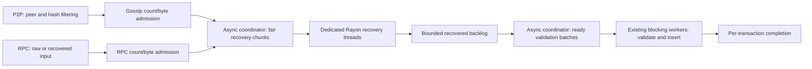

# Shared transaction ingress

`BatchTxProcessor` provides bounded admission, recovery and batch insertion above the transaction pool. Node construction creates one processor and explicitly passes its `BatchTxHandle` to RPC and the P2P transaction manager. The engine receives its pause handle through the node components. `TransactionPool`, `PoolConfig` and the pool itself have no ingress service or scheduler ownership.

This extends the existing transaction batcher with a bounded staged pipeline. One async coordinator dispatches sender recovery to a dedicated Rayon pool, re-batches recovered transactions, and dispatches validation plus insertion to the existing blocking validation workers. `TransactionValidator` needs no ingress-specific hooks. Custom pools use their existing insertion APIs through bounded blocking jobs. Standalone RPC instances construct the same processor when no shared handle is supplied.

Each source has its own transaction-count and estimated-byte budget. Admission uses nonblocking reservations and rejects immediately when either limit is exhausted. Reservations cover queued requests, executing jobs, and recovered RPC transactions awaiting forwarding or sidecar conversion. Canceling a caller does not release capacity still owned by a running worker. The worker skips canceled requests before recovery or validation, and completed requests release their reservation after insertion.

Recovery concurrency is configured independently with `--txpool.recovery-threads` (default: half the available CPUs, at least one); `--txpool.recovery-batch-size` controls recovery chunks (default 32). The Rayon pool is created on first unrecovered input and never has more outstanding jobs than threads, including jobs waiting to start and completed results. Already recovered input bypasses Rayon. Validation concurrency remains the configured validation-worker count, and `--txpool.max-batch-size` controls import batches (default 32). Both stages alternate RPC and P2P queues and dispatch available work immediately without a batching timer. Import batches can combine results from different recovery chunks. No response-ID map or global ordering buffer is needed: each transaction carries its origin, reply sender and admission permit through the pipeline.

Before recovery dispatch, each transaction also reserves one of `BatchTxConfig::max_recovered_transactions` slots (default 1024). This budget covers running recovery, completed recovery results, the recovered backlog, and queued/running imports. Stalled validation therefore stops recovery dispatch before filling the end-to-end admission budget. The existing per-source byte reservations also cover this entire intermediate stage, so both transaction count and retained estimated bytes are bounded. Each batch has an estimated-byte quantum; a larger admitted transaction runs alone.

The service owns the optional `SenderRecoveryCache` shared with payload execution. Both raw RPC decoding and pooled P2P recovery use the transaction type's checked recovery hooks. Successful recovery is cached immediately, before state validation or insertion; rejected admission does not erase that cryptographic result. Failed recovery is never cached. Legacy and typed transactions use the same hash-keyed cache, while chain-ID and fork validation remain separate. Caching remains opt-in through `--engine.sender-recovery-cache`; simultaneous cache misses are not deduplicated. State validation starts after recovery, so a batch does not hold a state provider while doing cryptographic work. Insertion and result delivery stay on the worker, avoiding insertion work in the transaction manager's poll or RPC runtime. The generic pool adapter submits recovered batches through bounded blocking jobs; the validation-worker adapter validates and inserts each recovered batch on an existing validation task. Database I/O and validation work, including blob proof checks, never run on the recovery pool.

RPC preserves the submission origin, raw subscription notifications, forwarding result, and blob-sidecar conversion behavior. Asynchronous preparation releases the worker while retaining the original admission permit. P2P retains peer attribution and result handling independently of message boundaries. Shared-service admission failures drop the transaction without entering the bad-transaction cache, penalizing peers or scheduling a refetch. Broadcasts truncate to the manager's remaining import capacity. Shared ingress continues draining completed fetch responses while full and drops excess bodies, so a long payload pause does not retain them in response channels. The manager polls newly admitted completions before sleeping so worker completion can wake the manager. Completions have a transaction-sized polling budget, avoiding artificial backpressure from counting finished imports as pending.

## Payload priority and lifecycle

`BatchTxHandle::pause_handle()` exposes a cloneable `TransactionIngressPause`, a typed wrapper around `TaskPause` identifying the coordination between payload validation and the RPC/P2P batcher. Every producer obtains an owned guard while doing foreground work. A watch channel holds the active-producer count, and ingress resumes only when the final guard drops. Cancellation and unwinding drop guards normally. Watch subscription rechecks the current count, avoiding a lost wakeup between checking and waiting. The basic engine validator holds a guard during live block/payload validation, including downloaded blocks; staged historical sync does not hold one. Other producers can use the same handle without changing ingress scheduling.

The coordinator stops dispatching while paused but continues polling both stages' completion handles. Recovery workers check between transactions, including before starting a queued job, and return unfinished inputs to the coordinator. Validation jobs check when a worker receives them and return the batch if paused. Workers never wait for a pause or downstream queue capacity. An already-running recovery finishes its current transaction; an already-running validation/insertion job finishes its bounded batch. This is cooperative scheduling rather than crypto preemption or a hard CPU deadline.

Admission and intermediate-stage reservations stay owned throughout pauses. Dropping all batcher handles wakes the coordinator and releases queued work; already-running work owns its reservations until it ends. Panicking recovery/import jobs release their inputs and close the associated replies without stranding capacity. RPC recovery notifications retain only the notification sender, avoiding a pool/queued-callback ownership cycle.

## Backpressure and retained memory

Every new entry point reserves capacity before queueing: pooled P2P, raw RPC, already-recovered RPC and adapter preparation. Permits cover queued and executing jobs, paused jobs and asynchronous preparation. The scheduler's internal channels are unbounded Tokio channels, but private enqueueing requires an owned count/byte permit; there is no unbounded queue of admission waiters. Recovery and validation each have an independent bound on dispatched jobs, including queued jobs and completion buffers. Results carrying a recovered transaction also carry its permit.

`PoolTransaction::ingress_size()` includes attached blob sidecars, which the Ethereum pool's resident-size estimate deliberately excludes. Raw RPC admission reserves the encoding plus an initial decoded-size estimate before dispatch; recovered-size growth is checked before publishing to the next stage. RPC accounting also includes retained raw bytes. Sidecar upcasting reserves additional proof storage before conversion, and forwarding reserves hex-encoding storage before allocation or an external await. Growth is nonblocking: insufficient room rejects the operation, and dropping the input releases its previous reservation. Canceled preparation retains its permit until its detached work finishes; the converter separately limits active conversions to five. Custom transaction types must include all retained sidecars in their ingress-size estimate.

The manager retains import-count reservations until completion futures are consumed, so worker completion cannot let undrained results accumulate without a bound. Its soft limit permits at most one additional bounded fetch response (255 extra transactions); ingress's independent count and byte limits still apply. Peer attribution is capped at eight identities per pending transaction, including across peer churn during long pauses. Dropped ingress transactions do not create retry storage or reset fetch-attempt limits.

These are bounds on admitted work, not a process RSS ceiling. Existing network message/decode limits and the separate transaction-event channel budget remain in effect before ingress admission. The latter defaults to 1 GiB and drops new events at capacity. Outstanding fetch requests are count-bounded (130 globally and one per peer by default), responses are verified against at most 256 requested hashes, and completed responses are drained even while shared ingress is full. Transport buffers, allocator overhead, transient decoding/conversion scratch space, subscription buffers, the sender cache and resident-pool/blob storage have separate limits; they are not included in the two 32 MiB ingress budgets. Independently constructed network managers can omit the batcher and retain their existing recovery path and limits; node construction explicitly injects it, including for custom pools.

## Configuration and limits

- `--txpool.recovery-threads` controls dedicated recovery concurrency; its default is half the available CPUs, at least one. `--txpool.recovery-batch-size` controls recovery chunks and defaults to 32.
- `--txpool.max-batch-size` controls validation/insertion batches; its default is 32.
- `--txpool.additional-validation-tasks` continues to control worker count (one base worker plus the configured additional tasks).
- `BatchTxConfig` configures per-source admission counts and bytes, and the byte quantum. Defaults are 4,096 transactions and 32 MiB per source, with a 256 KiB batch quantum.
- `EthApiBuilder::max_batch_size` controls a standalone RPC processor. An injected shared batcher owns its batch settings; `PoolBuilder::build_batcher` selects the execution adapter and can customize its configuration.
- The admission byte limit accounts for input estimates, including growth during recovery/conversion. It is not a bound on all allocator, RPC transport, or downstream cache memory.

Resident pool capacity is separate from ingress capacity. A full pool can still accept a higher-priority transaction or replacement, so resident fullness does not cause blanket pre-recovery rejection. Existing pool eviction and validation rules remain authoritative. Existing recovered-transaction pool APIs also remain available for internal callers.

A smaller recovery-thread budget limits parallel recovery CPU independently of validation concurrency. Under overload this can trade gossip admission throughput for RPC responsiveness and CPU available to chain processing. Raising validation concurrency can reduce downstream queueing, but does not change the recovery-thread budget. Neither setting removes pool write-lock contention or the cost of long per-account nonce chains. Count and byte quanta are not CPU deadlines: blob verification and chain-specific authorization work can require different settings.

## Measurements

Measured the staged implementation at `a6d68e0876` against main `4dd0cc021a` on `dev-mattsse` (AMD EPYC 4585PX). Both binaries used the same Rust 1.96.1 profiling-build recipe. The node used eight physical cores (16 logical CPUs), with separate generator CPUs, four validation workers and 32-transaction import batches. The candidate used eight dedicated recovery threads and 32-transaction recovery chunks. Existing Ethereum nodes remained running. Node and generators shared a 3 GiB cgroup; these are local comparisons, not production capacity estimates.

There were three alternating repeats per case: 36 txgen/dev-chain runs and 18 disjoint-sender payload-replay runs. Every measured run accepted all 20,000 RPC submissions; all dev-chain runs also mined them. No OOM kills or CPU throttling were observed. The cgroup reached its 3 GiB limit and experienced reclaim; peak sampled node RSS across all runs was 1,389 MiB. The cgroup limit includes generators and page cache, and ingress byte limits are not a process RSS ceiling.

Each run offered 20,000 RPC transfers at up to 5,000/s, with 256 concurrent requests and no retries. Mixed runs also offered 100,000 P2P transfers at 25,000/s in 256-transaction messages. Account and pool limits were raised to stress long nonce chains. Txgen/dev-chain cases used 500 ms blocks, sender caching disabled, and either no pending limiter or `--max-pending 5000`.

Values below are medians of three runs, main → candidate. CPU is node-wide user plus system time. RPC p99 measures submission acknowledgement, excluding time waiting for the txgen pending limiter and time waiting for inclusion. Inclusion completion is sampled approximately once per second.

| Traffic | Max pending | CPU in ~16 s (s) | Pool insertions by RPC completion | RPC p99 (ms) | All RPC mined (s) |
|---|---:|---:|---:|---:|---:|
| rpc-only | 0 | 3.40 → 3.72 | 20,000 → 20,000 | 0.440 → 0.365 | 7.64 → 7.66 |
| rpc-only | 5,000 | 3.36 → 3.72 | 20,000 → 20,000 | 0.245 → 0.298 | 7.64 → 7.65 |
| fetch | 0 | 12.08 → 12.28 | 93,632 → 92,960 | 15.912 → 11.563 | 20.85 → 22.02 |
| fetch | 5,000 | 11.81 → 11.35 | 95,936 → 94,656 | 13.359 → 9.020 | 20.85 → 20.96 |
| broadcast | 0 | 13.67 → 11.97 | 108,736 → 95,584 | 102.725 → 11.397 | 22.03 → 20.93 |
| broadcast | 5,000 | 13.02 → 11.20 | 109,600 → 96,800 | 105.116 → 10.810 | 22.18 → 20.94 |

The additional stage costs roughly 9–11% more CPU in RPC-only runs. Broadcast-load RPC p99 improves by about 89–90%, but the candidate admits about 12% fewer transactions overall; part of its lower total CPU comes from shedding gossip. Fetched-load RPC p99 improves by about 27–32%; uncapped RPC inclusion completion is about 1.2 seconds slower. Included throughput in mixed dev-chain runs stays around 2.9k transactions/s and is constrained by block production, so it is not a measure of maximum ingress capacity.

Replay cases import the same 45 payloads containing 62,748 P2P-source transactions while RPC uses disjoint senders. All payloads returned VALID. Three warmup payloads are excluded; each run provides 40 nonempty timed payloads. At that sample count p99 is the maximum, so tail comparisons remain noisy.

| Replay traffic | Sender cache | CPU µs/insertion | Pool insertions | RPC p99 (ms) | newPayload p95 / p99 (ms) |
|---|---|---:|---:|---:|---:|
| fetch | Off | 126.6 → 128.6 | 111,100 → 109,528 | 10.445 → 14.789 | 10.247 / 13.430 → 9.580 / 9.958 |
| fetch | On | 110.1 → 112.7 | 111,612 → 110,588 | 10.584 → 12.937 | 6.280 / 7.235 → 6.361 / 7.101 |
| broadcast | On | 113.8 → 109.5 | 111,612 → 112,200 | 20.881 → 11.423 | 7.023 / 8.797 → 6.370 / 6.992 |

CPU per insertion includes payload processing and is not an isolated recovery cost. During payload replay, fetched RPC p99 worsens by about 22–42%, while broadcast RPC p99 improves by about 45%. The cache-off fetched and cache-on broadcast cases have lower median-run payload tails; cache-on fetched payload timing is close between builds. These tradeoffs do not establish a universal throughput improvement.

Both ingress lanes recorded zero admission rejections in this matrix; upstream P2P import limits still shed offered work. Candidate sampled outstanding work peaked at 10 RPC and 3,968 P2P requests against separate 4,096-request budgets. Samples can miss shorter peaks. Unit and integration tests separately cover admission exhaustion, byte growth, stalled validation, payload pauses, cancellation, shutdown and panics.

The [earlier measurements](https://github.com/paradigmxyz/reth/blob/b26425bcab790bc3daf3591a14c05479e41ddb05/docs/design/transaction-ingress.md#measurements) cover preceding implementations, including different batching and overload cases. Those results must not be attributed to this staged implementation.

## Live Ethereum observation

Restarted one synced mainnet node on `dev-mattsse` at 14:51:05 UTC on 2026-09-19 with the measured `a6d68e0876` binary and unchanged runtime arguments. The other Ethereum nodes remained running. The candidate used the default 16 recovery threads on the full 32-logical-CPU host. The previous binary was `2f46c5e2f`, the direct predecessor of the controlled benchmark base; the intervening change concerns historical SnapSync verification.

Observed the candidate for 43.7 minutes after restart. Peer connections took about 33 minutes to recover; the steady comparison below starts at 15:24:14 UTC, with 95–101 peers, and lasts 10.6 minutes. The before window excludes the candidate build and benchmark load. CPU is percent of one logical CPU; throughput counts successful pool insertions, not unique transactions or block inclusion.

| Window / node | Seconds | Pool insertions/s | CPU % | RSS median (MiB) | Payload count | newPayload mean / p95 / p99 (ms) |
|---|---:|---:|---:|---:|---:|---:|
| Before / selected node | 455 | 157.7 | 12.65 | 10,636 | 38 | 26.21 / 54.64 / 63.43 |
| Before / reference | 455 | 155.2 | 13.66 | 11,087 | 38 | 27.02 / 55.72 / 64.46 |
| After / candidate | 635 | 173.7 | 16.33 | 7,038 | 53 | 28.54 / 51.10 / 72.41 |
| After / reference | 635 | 153.7 | 13.12 | 12,009 | 53 | 27.69 / 55.45 / 73.02 |

The candidate remained synced and tracked the reference head, with no newPayload invalid/error counter increments in the measured post-startup windows. Steady-window P2P admission was 193,295 transactions with 0 capacity rejections. Sampled P2P outstanding work peaked at 32 transactions and 13,296 estimated bytes; no RPC submission traffic was observed. P2P mean pre-recovery queue wait was 121.5 µs, recovery 29.9 µs, and validation queue wait 180.6 µs.

This live window establishes normal chain progress under actual P2P traffic, but does not isolate a performance effect. The candidate and reference see different gossip, and the unchanged reference runs a different branch. Restarted caches and different blocks confound before/after comparisons. In particular, the lower candidate RSS must not be attributed to ingress, and a short observation does not establish long-term memory behavior. newPayload means use counter deltas; tail estimates use the latest completed payload at five-second samples (53 steady samples, 0 unobserved payloads), so tail precision is limited. The healthy candidate remains running; rollback instructions and original arguments are retained on the dev box.

## Tempo integration

[Tempo #7762](https://github.com/tempoxyz/tempo/pull/7762) integrates this Reth change while preserving the hybrid transaction pool and explicitly routing raw RPC through shared ingress. A regression test verifies admission before recovery. The matched baseline `375728ccfd3d` pins the same upstream Reth base, and feature `2bcac0b98108` contains the integration plus a test-future stack fix. Linux tests, RPC/e2e tests, Clippy and the other build checks passed.

The requested `public-mix` txgen/building benchmark was dispatched for three 90-second baseline/feature pairs, 100 GiB state, 50,000 offered TPS, 1,000 accounts, 100 concurrent requests and four tokens. All three execution attempts across [the first run](https://github.com/tempoxyz/tempo/actions/runs/35450026162) and [the final feature run](https://github.com/tempoxyz/tempo/actions/runs/35451041630) failed before compilation: the runner firewall could not bind `127.0.0.1:443` on `ghr-euw-04` / `ghr-euw-05`. No Tempo performance result is available. Runner repair or a healthy accessible runner is required; stale artifacts left in those workspaces were excluded.
