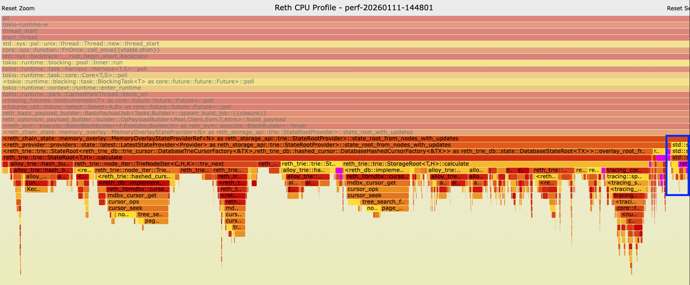
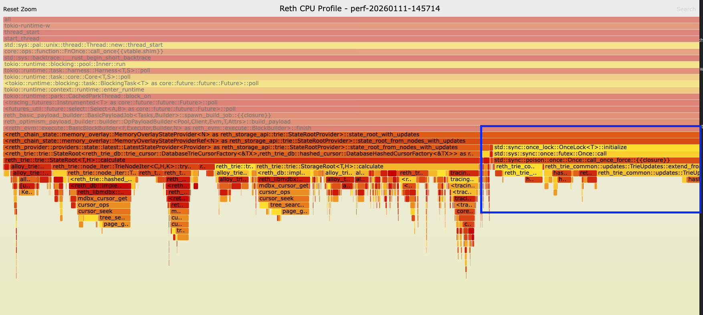
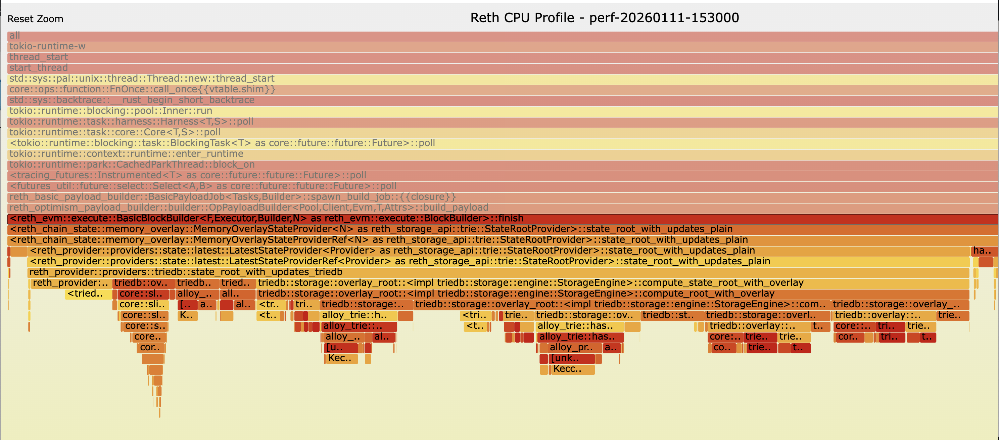
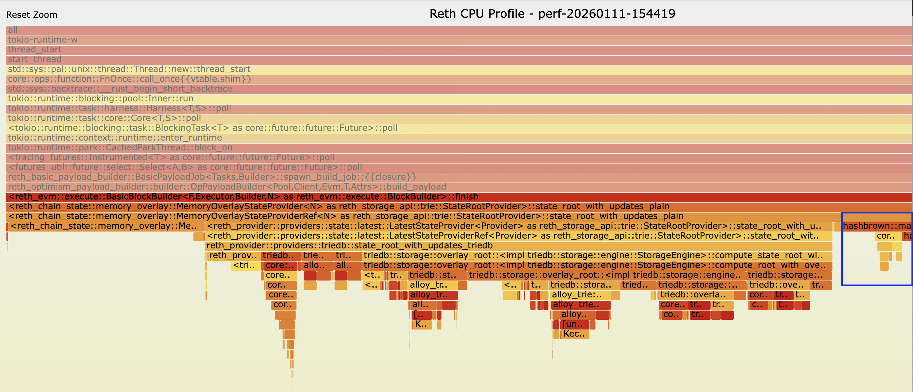

# TrieDB Performance Report

## 1. Introduction

Base has an amazing database `triedb` (TDB) which is built directly on `mmap` disk. See [github.com/base/triedb](https://github.com/base/triedb). While MDBX is a general key-value store (whose page structure is a binary tree), TDB's page design is optimized for MPT (Merkle Patricia Trie) structure. In this doc, we present the result benchmarking the performance of TDB.

### Where Reth Interacts with TrieDB

1. **During init_genesis**: Reth calculates state root in memory and collects trie nodes, then persists them asynchronously in batches. With TDB, the overall `init_genesis` performance is poor. See [issue #179](https://github.com/base/triedb/issues/179). However, this is only one time work, which does not impact actual block production performance.

2. **During payload validation**: Uses `StateRootTask` to recalculate the state root with multi-threaded proof revealing. This is only important for RPC nodes. we will provide another benchmark on this separately.

3. **During block production**: Calculates state root after EVM execution. This is the core logic affecting block production performance and is the focus of this benchmark.


---

## 2. Microbenchmark: State Root Calculation
We firstly write a benchmark for `state_root_overlay` only, comparing TDB and the MDBX way. (in reality, reth use memory overlay to cache trie nodes, which can improve the performance a bit. we will give a detailed analysis later on. but for this section, we only compare TDB against MDBX, i.e no memory overlay)

### Setup

- **Base state**: 100,000 accounts with 10 storage slots each
- **Overlay sizes**: 1,000 & 10,000 account updates
- **Sample size**: 10 iterations per benchmark

### Running the Benchmark

```bash
cargo bench -p reth-provider --features "test-utils,triedb" --bench bench_state_root_overlay
```

### Results

#### Overlay Size: 1,000 accounts

| Implementation | Mean      | Range                   | Speedup |
|----------------|-----------|-------------------------|---------|
| MDBX           | 416.58 ms | [413.75 ms - 419.56 ms] | 1x      |
| TrieDB         | 3.17 ms   | [3.15 ms - 3.19 ms]     | **131x**|


#### Overlay Size: 10,000 accounts

| Implementation | Mean      | Range                   | Speedup |
|----------------|-----------|-------------------------|---------|
| MDBX           | 425.56 ms | [422.67 ms - 428.68 ms] | 1x      |
| TrieDB         | 37.45 ms  | [37.10 ms - 37.92 ms]   | **11x** |


### Analysis

- **TrieDB is dramatically faster** for state root calculation with overlay states
- At 1,000 account overlay: TrieDB is ~131x faster than MDBX
- At 10,000 account overlay: TrieDB is ~11x faster than MDBX
- MDBX performance is relatively constant regardless of overlay size (~417-426ms)
- TrieDB scales linearly with overlay size (3.2ms -> 37.5ms for 10x more accounts)
- TrieDB's advantage is most pronounced with smaller overlays

---

## 3. Real-World Benchmark: Block Production
For this section, we launched an op-node locally. we spam txs and measure the TPS and state_root calculation time.

### Benchmark Configuration

- **Commit**: 35add05ef334580588819474127d9ae9e0dfcc2b
- **Block gas limit**: 500M
- **Block interval**: 1s
- **PERSISTENCE_THRESHOLD**: 2 (default)

### Hardware

- **Chip**: Apple M4 Pro
- **Memory**: 48 GB

### Test Data

| Dataset | EOA Accounts | Contract Accounts | Storage per Contract | Genesis Size |
|---------|--------------|-------------------|----------------------|--------------|
| Small   | 2,000,000    | 500,000           | 10                   | ~1 GB        |
| Medium  | 8,000,000    | 2,000,000         | 40                   | ~3 GB        |

> **Note**: If benchmarking with an empty dataset, TDB's performance is worse compared to the original version because MDBX binary tree lookup overhead is minimized with small datasets. However, in reality, the trie data is huge, more than the testing dataset.

### Method

Launch an op-node with randomly created data. deploys an ERC20 contract and creates 2000 EOA accounts. Then spam with ERC20 transfer transaction, using [xlayer-toolkit/tools/adventure](https://github.com/okx/xlayer-toolkit/tree/main/tools/adventure). The max pending transactions in pool is kept at 50k.


### Results

#### Small Data (1GB genesis)

| Metric | Without TDB | With TDB | Improvement |
|--------|-------------|----------|-------------|
| **TPS** | 9,283 | 11,194 | **+20.58%** |
| **State Root (avg)** | 414ms | 130ms | **3.18x faster** |
| **State Root (max)** | 615ms | 137ms | - |

#### Medium Data (3GB genesis)

| Metric | Without TDB | With TDB | Improvement |
|--------|-------------|----------|-------------|
| **TPS** | 8,335 | 10,324 | **+23.86%** |
| **State Root (avg)** | 904ms | 144ms | **6.27x faster** |
| **State Root (max)** | 1.44s | 157ms | - |

---
With larger dataset, the improvement of TDB is more pronounced.

## 4. Analysis: PERSISTENCE_THRESHOLD Impact

The `PERSISTENCE_THRESHOLD` controls how many executed block output cached in memory before flushed to the database. We analyzed its impact on performance on the small data (1GB genesis).

### Results by PERSISTENCE_THRESHOLD

| Threshold | Without TDB | | With TDB | | TPS Improvement | State Root Speedup |
|-----------|-------------|---------------|----------|---------------|-----------------|-------------------|
| | TPS | State Root | TPS | State Root | | |
| **2** (default) | 9,283 | 414ms | 11,194 | 130ms | **+20.6%** | **3.18x** |
| **8** | 9,062 | 468ms | 10,367 | 137ms | **+14.4%** | **3.42x** |
| **32** | 7,721 | 655ms | 10,759 | 148ms | **+39.4%** | **4.43x** |
| **128** | 8,283 | 657ms | 9,854 | 183ms | **+19.0%** | **3.59x** |
| **512** | 7,172 | 756ms | 8,798 | 268ms | **+22.7%** | **2.82x** |

### Key Findings

1. **Without TDB**: TPS degrades as threshold increases (9,283 → 7,172), and state_root calculation time increases significantly (414ms → 756ms). This is because `TrieUpdates::extend_ref` takes more time as it iterates over more block trie updates.

2. **With TDB**: TPS remains relatively stable (11,194 → 8,798), and state_root time increases modestly (130ms → 268ms). TDB merges plain state instead of extending trie nodes, which is much faster.

3. **Optimal Setting**: The default `PERSISTENCE_THRESHOLD=2` with TDB enabled achieves the highest TPS (11,194) and fastest state root calculation (130ms).

---

## 5. CPU Profiling Analysis
To validate the hypothesis that `TrieUpdates::extend` functions are the bottleneck when `PERSISTENCE_THRESHOLD` increases, we conducted CPU profiling using Linux `perf`.

### Profiling Setup

- **Tool**: Linux perf with flamegraph visualization
- **Duration**: 60 seconds per profile
- **Comparison**: threshold=2 vs threshold=32 (without TDB)
- **Workload**: ERC20 transfer spam on 1GB genesis


### Flamegraph Comparison

#### Threshold=2 (Default)



In this flamegraph, search for `extend_from_sorted` - it consumes **~1.8%** of total CPU time.

**Call path to the bottleneck:**
```
BasicBlockBuilder::finish
  └── MemoryOverlayStateProvider::state_root_with_updates
        └── MemoryOverlayStateProviderRef::state_root_from_nodes_with_updates
              └── LatestStateProvider::state_root_from_nodes_with_updates
                    └── DatabaseStateRoot::overlay_root_from_nodes_with_updates
                          └── StateRoot::calculate
                                └── TrieUpdates::extend_from_sorted  ◀ 1.8% CPU
                                └── StorageTrieUpdates::extend_from_sorted
                                └── HashedPostState::extend_from_sorted
```

#### Threshold=32



With threshold=32, the `extend_from_sorted` functions grow to **~11.5%** of total CPU time. **The bars are visibly wider in the flamegraph**, indicating significantly more CPU time spent merging trie updates from 32 cached blocks.

### Profiling Results: The Bottleneck Identified

#### `extend_from_sorted` Functions (The Primary Bottleneck)

| Function | Threshold=2 | Threshold=32 | Increase |
|----------|-------------|--------------|----------|
| **`TrieUpdates::extend_from_sorted`** | 1.42B samples (1.8%) | 8.18B samples (11.5%) | **5.75x** |
| **`StorageTrieUpdates::extend_from_sorted`** | 179M samples (0.2%) | 1.09B samples (1.5%) | **6.1x** |
| **`HashedPostState::extend_from_sorted`** | 313M samples (0.4%) | 2.29B samples (3.2%) | **7.3x** |
| **Total extend overhead** | 1.91B samples (2.4%) | 11.56B samples (16.2%) | **6.0x** |

> Note: B = Billion samples, M = Million samples. More samples = more CPU time spent in that function.

#### State Root Calculation Functions (Faster with More Cache)

| Function | Threshold=2 | Threshold=32 | Change |
|----------|-------------|--------------|--------|
| `StateRoot::calculate` | 17.2B samples | 13.2B samples | **-23%** (faster) |
| `overlay_root_from_nodes_with_updates` | 17.3B samples | 13.2B samples | **-23%** (faster) |

### Analysis

The profiling confirms the hypothesis:

1. **The bottleneck is in merging trie updates, not in state root calculation itself.**
   - `extend_from_sorted` functions show **5.75x - 7.3x increase** in CPU time
   - These functions merge trie updates from multiple cached blocks
   - Total overhead grows from 2.4% to 16.2% of CPU time

2. **State root calculation is actually faster at higher thresholds.**
   - `StateRoot::calculate` is **23% faster** at threshold=32
   - This is expected: more trie nodes cached in memory → fewer disk reads
   - More cache hits during trie traversal

3. **The merging overhead outweighs the cache benefit.**
   - With threshold=32, you're merging updates from 32 blocks instead of 2
   - Each `extend_from_sorted` call iterates over accumulated trie nodes from all cached blocks
   - Net result: overall performance degrades despite faster trie traversal

### Why TDB Avoids This Problem

TDB merges **plain state** (account addresses and storage keys) instead of **trie nodes**:

| Approach | Data to Merge | Complexity |
|----------|---------------|------------|
| Without TDB | Pre-computed trie nodes (branch nodes, extension nodes, leaf nodes) | O(n) where n = total trie nodes across all cached blocks |
| With TDB | Plain state (addresses, storage keys) | O(m) where m = unique accounts/storage modified |

**Key insight**: Plain state is much smaller and simpler to merge than trie node structures:
- Trie nodes include intermediate branch/extension nodes that grow with tree depth
- Plain state only includes the actual modified accounts and storage slots
- Merging plain state is essentially a hashmap union operation

This is why TDB maintains stable performance even at higher thresholds - the merging cost doesn't scale with the number of cached blocks in the same way.

---

## 6. CPU Profiling: TDB vs No-TDB Comparison

To further validate TDB's performance advantage, we conducted additional profiling comparing TDB and no-TDB implementations at both threshold=2 and threshold=32. Since no-TDB cpu profiling result is given above, here we only present the profiling result with TDB

### with TDB, threshold=2


### with TDB, threshold=32



**Key finding**: TDB uses 20-22% fewer CPU cycles than no-TDB at the same threshold.

### The `extend_from_sorted` Bottleneck: Eliminated by TDB

| Configuration | `extend_from_sorted` Samples | % of Total |
|---------------|------------------------------|------------|
| No TDB, T=2 | 1.74B | 2.2% |
| No TDB, T=32 | 10.47B | **14.7%** |
| **TDB, T=2** | **0** | **0%** |
| **TDB, T=32** | **0** | **0%** |

**TDB completely eliminates the `extend_from_sorted` bottleneck** by using a different code path that operates on plain state rather than trie nodes.

### State Root Overhead Comparison

| Configuration | state_root Samples | % of Total |
|---------------|-------------------|------------|
| No TDB, T=2 | 18.77B | 23.8% |
| No TDB, T=32 | 19.75B | 27.7% |
| **TDB, T=2** | **7.89B** | **12.8%** |
| **TDB, T=32** | **12.01B** | **19.1%** |

**TDB reduces state root overhead by 2-2.4x** compared to no-TDB at the same threshold.

### Scaling Behavior: TDB vs No-TDB

| Metric | No TDB (T=2 → T=32) | TDB (T=2 → T=32) |
|--------|---------------------|------------------|
| `extend_from_sorted` increase | **6.0x** (1.74B → 10.47B) | **0x** (eliminated) |
| state_root % increase | +3.9% (23.8% → 27.7%) | +6.3% (12.8% → 19.1%) |
| Total samples change | -9.7% | **+2.5%** |

**Key insight**: 
- Without TDB, the `extend_from_sorted` bottleneck grows 6x when threshold increases from 2 to 32. With TDB, this bottleneck is completely eliminated.
- TDB is better than no-TDB at same threhold setting
   - At T=2: TDB uses **22% fewer** CPU cycles (61.47B vs 78.80B)
   - At T=32: TDB uses **11.4% fewer** CPU cycles (63.02B vs 71.17B)
- TDB's advantage is most pronounced at lower thresholds, but remains significant at all thresholds

---

## 7. Summary

### Performance Improvements with TrieDB

| Dataset | TPS Improvement | State Root Speedup |
|---------|-----------------|-------------------|
| Small (1GB) | +20.58% | 3.18x |
| Medium (3GB) | +23.86% | 6.27x |

### CPU Profiling: Bottleneck Without TDB

| Metric | Threshold=2 | Threshold=32 | Impact |
|--------|-------------|--------------|--------|
| `extend_from_sorted` CPU % | 2.4% | 16.2% | **6.0x worse** |
| `StateRoot::calculate` | baseline | -23% | **Faster (more cache)** |
| Net TPS | 9,283 | 7,721 | **-17% degradation** |

### CPU Profiling: TDB Eliminates the Bottleneck

| Metric | No TDB | With TDB | Improvement |
|--------|--------|----------|-------------|
| CPU samples (T=2) | 78.80B | 61.47B | **-22%** |
| CPU samples (T=32) | 71.17B | 63.02B | **-11.4%** |
| `extend_from_sorted` overhead | 2.2% - 14.7% | **0%** | **Eliminated** |
| state_root overhead | 23.8% - 27.7% | 12.8% - 19.1% | **~2x reduction** |

### Key Takeaways

- **TrieDB provides significant performance improvements** for block production on sequencer nodes
- **Larger datasets benefit more** from TrieDB (6.27x speedup on 3GB vs 3.18x on 1GB)
- **TDB maintains stable performance** even with higher PERSISTENCE_THRESHOLD values, where the original implementation degrades significantly
- **Microbenchmarks show up to 131x speedup** for isolated state root calculations
- **CPU profiling confirms** the bottleneck is in `TrieUpdates::extend_from_sorted` functions, which scale poorly with higher thresholds (6x overhead increase from threshold=2 to threshold=32)
- **TDB eliminates the `extend_from_sorted` bottleneck entirely** by using a different code path that operates on plain state
- **TDB uses 20-22% fewer CPU cycles** compared to no-TDB at the same workload
- **Recommended configuration**: `PERSISTENCE_THRESHOLD=2` (default) with TDB enabled
