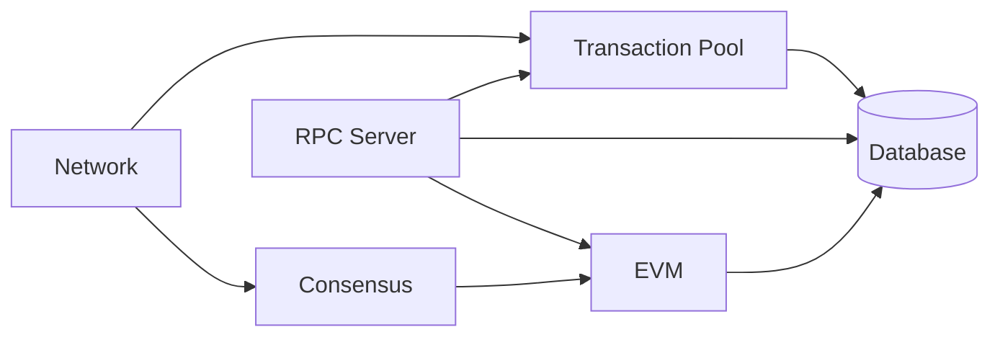

# Node Components

Reth's modular architecture allows developers to customize and extend individual components of the node. Each component serves a specific purpose and can be replaced or modified to suit your needs.

## Architecture Overview

A Reth node consists of several key components that work together and can interact with each other:



## Core Components

### [Network](/sdk/node-components/network)
Handles P2P communication, peer discovery, and block/transaction propagation. The network component is responsible for:
- Peer discovery and management
- Transaction gossip
- State synchronization (downloading blocks)
- Protocol message handling

### [Transaction Pool](/sdk/node-components/pool)
Manages pending transactions before they're included in blocks:
- Transaction validation
- Ordering and prioritization
- Transaction replacement logic
- Pool size management and eviction

### [Consensus](/sdk/node-components/consensus)
Validates blocks according to protocol rules:
- Header validation (e.g. gas limit, base fee)
- Block body validation (e.g. transaction root)

### [EVM](/sdk/node-components/evm)
Executes transactions and manages state transitions:
- Block execution
- Transaction execution
- Block building

### [RPC](/sdk/node-components/rpc)
Provides external API access to the node:
- Standard Ethereum JSON-RPC methods
- Custom endpoints
- WebSocket subscriptions

## Component Customization

Each component can be customized through Reth's builder pattern. You can replace individual components
while keeping the defaults for others using `EthereumNode::components()`:

```rust
use reth_ethereum::{
    cli::interface::Cli,
    node::{
        node::EthereumAddOns,
        EthereumNode,
    },
};

fn main() {
    Cli::parse_args()
        .run(|builder, _| async move {
            let handle = builder
                // Use the default ethereum node types
                .with_types::<EthereumNode>()
                // Configure the components of the node
                // Use default ethereum components but replace specific ones
                .with_components(
                    EthereumNode::components()
                        // Custom transaction pool
                        .pool(CustomPoolBuilder::default())
                        // Other customizable components:
                        // .network(CustomNetworkBuilder::default())
                        // .executor(CustomExecutorBuilder::default())
                        // .consensus(CustomConsensusBuilder::default())
                        // .payload(CustomPayloadBuilder::default())
                )
                .with_add_ons(EthereumAddOns::default())
                .launch()
                .await?;

            handle.wait_for_node_exit().await
        })
        .unwrap();
}
```

Custom component builders must implement their respective traits (`PoolBuilder`, `NetworkBuilder`, 
`ExecutorBuilder`, `ConsensusBuilder`, `PayloadServiceBuilder`). Each trait requires implementing 
an async `build_*` method that receives a `BuilderContext` with access to node configuration, 
providers, and task executors.

For complete working examples with full trait implementations, see:
- [custom-node-components](https://github.com/paradigmxyz/reth/tree/main/examples/custom-node-components) - Custom transaction pool
- [custom-payload-builder](https://github.com/paradigmxyz/reth/tree/main/examples/custom-payload-builder) - Custom payload builder
- [custom-evm](https://github.com/paradigmxyz/reth/tree/main/examples/custom-evm) - Custom EVM configuration

## Component Lifecycle

Components follow a specific lifecycle starting from node builder initialization to shutdown:

1. **Initialization**: Components are created with their dependencies
2. **Configuration**: Settings and parameters are applied
3. **Startup**: Components begin their main operations
4. **Runtime**: Components process requests and events
5. **Shutdown**: Graceful cleanup and resource release


## Next Steps

Explore each component in detail:
- [Network Component](/sdk/node-components/network) - P2P and synchronization
- [Transaction Pool](/sdk/node-components/pool) - Mempool management  
- [Consensus](/sdk/node-components/consensus) - Block validation
- [EVM](/sdk/node-components/evm) - Transaction execution
- [RPC](/sdk/node-components/rpc) - External APIs
