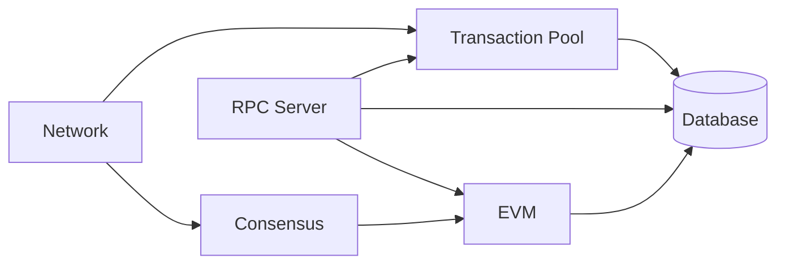

# Node Components

Reth's modular architecture allows developers to customize and extend individual components of the node. Each component serves a specific purpose and can be replaced or modified to suit your needs.

## Architecture Overview

A Reth node consists of several key components that work together and can interact with each other:



## Core Components

### [Network](/sdk/node-components/network)
Handles P2P communication, peer discovery, and block/transaction propagation. The network component is responsible for:
- Peer discovery and management
- Transaction gossip
- State synchronization (downloading blocks)
- Protocol message handling

### [Transaction Pool](/sdk/node-components/pool)
Manages pending transactions before they're included in blocks:
- Transaction validation
- Ordering and prioritization
- Transaction replacement logic
- Pool size management and eviction

### [Consensus](/sdk/node-components/consensus)
Validates blocks according to protocol rules:
- Header validation (e.g. gas limit, base fee)
- Block body validation (e.g. transaction root)

### [EVM](/sdk/node-components/evm)
Executes transactions and manages state transitions:
- Block execution
- Transaction execution
- Block building

### [RPC](/sdk/node-components/rpc)
Provides external API access to the node:
- Standard Ethereum JSON-RPC methods
- Custom endpoints
- WebSocket subscriptions

## Component Customization

Each component can be customized through Reth's builder pattern:

```rust
use reth_ethereum::node::{EthereumNode, NodeBuilder};

let node = NodeBuilder::new(config)
    .with_types::<EthereumNode>()
    .with_components(|ctx| {
        // Use the ComponentBuilder to customize components
        ctx.components_builder()
            // Custom network configuration
            .network(|network_builder| {
                network_builder
                    .peer_manager(custom_peer_manager)
                    .build()
            })
            // Custom transaction pool
            .pool(|pool_builder| {
                pool_builder
                    .validator(custom_validator)
                    .ordering(custom_ordering)
                    .build()
            })
            // Custom consensus
            .consensus(custom_consensus)
            // Custom EVM configuration
            .evm(|evm_builder| {
                evm_builder
                    .with_precompiles(custom_precompiles)
                    .build()
            })
            // Build all components
            .build()
    })
    .build()
    .await?;
```

## Component Lifecycle

Components follow a specific lifecycle starting from node builder initialization to shutdown:

1. **Initialization**: Components are created with their dependencies
2. **Configuration**: Settings and parameters are applied
3. **Startup**: Components begin their main operations
4. **Runtime**: Components process requests and events
5. **Shutdown**: Graceful cleanup and resource release


## Next Steps

Explore each component in detail:
- [Network Component](/sdk/node-components/network) - P2P and synchronization
- [Transaction Pool](/sdk/node-components/pool) - Mempool management  
- [Consensus](/sdk/node-components/consensus) - Block validation
- [EVM](/sdk/node-components/evm) - Transaction execution
- [RPC](/sdk/node-components/rpc) - External APIs
