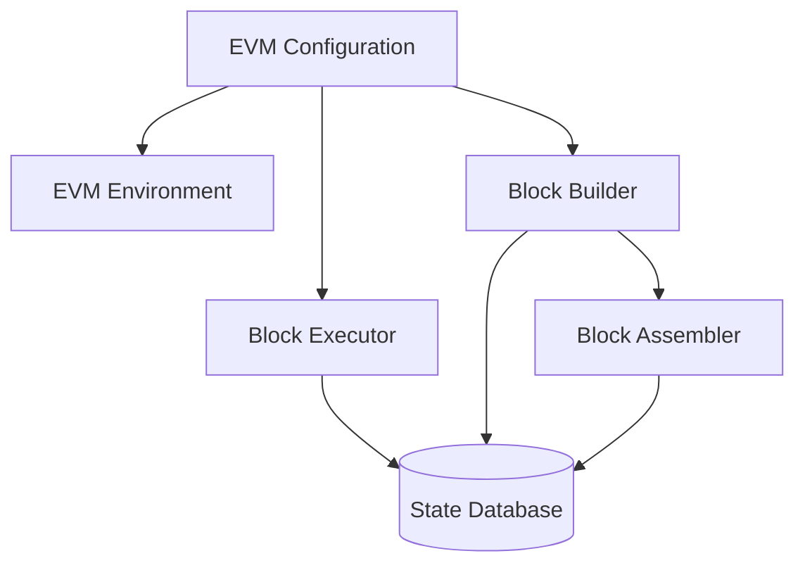

# EVM Component

The EVM (Ethereum Virtual Machine) component handles transaction execution and state transitions. It's responsible for processing transactions and updating the blockchain state.

## Overview

The EVM component manages:
- Transaction execution
- State transitions and updates
- Gas calculation and metering
- Custom precompiles and opcodes
- Block execution and validation
- State management and caching

## Architecture

## Key Concepts

### Transaction Execution
The EVM executes transactions in a deterministic way:
1. **Environment Setup**: Configure block and transaction context
2. **State Access**: Load accounts and storage from the database
3. **Execution**: Run EVM bytecode with gas metering
4. **State Updates**: Apply changes to accounts and storage
5. **Receipt Generation**: Create execution receipts with logs

### Block Execution
Block executors process all transactions in a block:
- Validate pre-state conditions
- Execute transactions sequentially
- Apply block rewards
- Verify post-state (state root, receipts root)

### Block Building
Block builders construct new blocks for proposal:
- Select transactions (e.g. mempool)
- Order and execute transactions
- Seal the block with a header (state root)

### Payload Building (Engine API)
Payload building is used when the execution layer works together with a consensus client over the Engine API:
- The consensus layer provides attributes for the next block (timestamp, fee recipient, randomness, gas limit, withdrawals, beacon block root).
- The EVM component derives the next block environment from these attributes and the parent header.
- A block builder executes selected transactions in this environment and hands the results to a block assembler to produce a block candidate.

## Next Steps

- Learn about [RPC](/sdk/node-components/rpc) server integration
- Explore [Transaction Pool](/sdk/node-components/pool) interaction
- Review [Consensus](/sdk/node-components/consensus) validation
