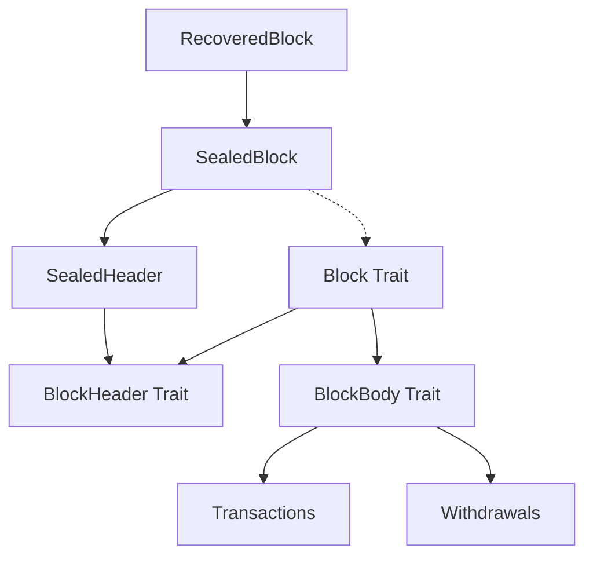

# Block Types

The Reth type system provides a flexible abstraction for blocks through traits, allowing different implementations while maintaining type safety and consistency.

## Type Relationships

## Next Steps

- Learn about [Transaction Types](/sdk/typesystem/transaction-types)
- Understand [Consensus](/sdk/node-components/consensus) validation
- Explore [EVM](/sdk/node-components/evm) execution
