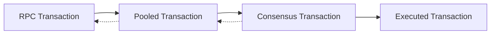

# Transaction Types and Representations

Reth provides multiple transaction representations optimized for different stages of the transaction lifecycle. Understanding these types is crucial for working with the node's transaction handling pipeline.

## Transaction Lifecycle

Transactions go through several stages, each with its own optimized representation:

## Transaction Representations

### RPC Transaction

The RPC representation is designed for JSON-RPC communication with external clients. It uses JSON-compatible types and includes all information clients need to understand transaction status.

Key characteristics:
- **JSON-compatible types**: Uses U256 for numbers, hex strings for binary data
- **Optional fields**: Supports both legacy and EIP-1559 transactions with appropriate fields
- **Block context**: Includes block hash, number, and index when transaction is mined
- **Human-readable**: Optimized for external consumption and debugging
- **Complete information**: Contains all transaction details including signature components

Use cases:
- Sending transactions via `eth_sendTransaction`
- Querying transaction details via `eth_getTransactionByHash`
- Transaction receipts and history
- Block explorer displays

### Pooled Transaction

The pooled representation is optimized for mempool storage and validation. It pre-computes expensive values and includes additional data needed for pool management.

Key characteristics:
- **Cached values**: Pre-computed sender address and transaction cost to avoid repeated calculations
- **Validation ready**: Includes all data needed for quick pool validation
- **Blob support**: Handles EIP-4844 blob sidecars separately from the core transaction
- **Memory efficient**: Optimized structure for storing thousands of pending transactions
- **Priority ordering**: Structured for efficient sorting by gas price/priority fee

Use cases:
- Transaction pool storage and management
- Gas price ordering and replacement logic
- Validation against account state
- Broadcasting to peers

### Consensus Transaction

The consensus representation is the canonical format used in blocks and for network propagation. It's the most compact representation and follows Ethereum's wire protocol.

Key characteristics:
- **Type safety**: Enum variants for different transaction types (Legacy, EIP-2930, EIP-1559, EIP-4844)
- **Compact encoding**: For storage on disk
- **No redundancy**: Minimal data, with values like sender recovered from signature when needed

Use cases:
- Block construction and validation
- Network propagation between nodes
- Persistent storage in the database
- State transition execution

## Representation Conversions

### RPC → Pooled
When transactions arrive via RPC:
1. Validate JSON format and fields
2. Convert to consensus format
3. Recover sender from signature
4. Create pooled representation

### Pooled → Consensus
When including in a block:
1. Extract core transaction consensus data
2. Remove cached values (sender, cost)

### Consensus → RPC
When serving RPC requests:
1. Add block context (hash, number, index)

## Next Steps

- Learn about [Block Types](/sdk/typesystem/block) and how transactions fit in blocks
- Understand [Transaction Pool](/sdk/node-components/pool) management
- Explore [EVM](/sdk/node-components/evm) transaction execution