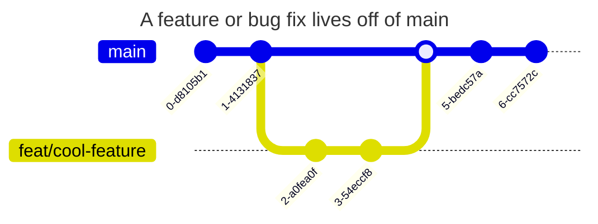
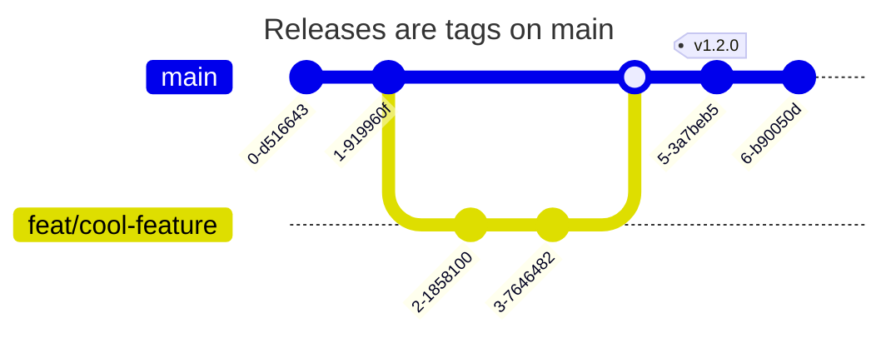

## Workflow

### Assigning issues

Before working on an issue, it should be assigned to the person who wants to work on it. For core contributors, this means assigning yourself to the issue, and for external contributors this means asking to be assigned on the issue. This is to avoid double work.

### Pull requests

- Features and bug fixes live on feature branches off of the main branch, and they are merged onto main as well.  
  This means that the latest version of reth (which might be unstable) always lives on main.
- Pull requests should not be merged without the review of at least one core contributor. For larger pull requests, at least two is recommended.
- Important pull requests that should be highlighted in the changelog should be marked with the https://github.com/paradigmxyz/reth/labels/M-changelog label.

### Releases

Releases are commits tagged with a version number on main (see [Releases](./release.md)).

### CI

- Every PR undergoes various checks, including:
  - Lints ([clippy], [rustfmt], ...)
  - Unit tests
  - Fuzz tests
  - Integration tests (including peering and a testnet simulation)
- Additionally, each PR is again tested before release by being run every night on a live testnet

[clippy]: https://github.com/rust-lang/rust-clippy
[rustfmt]: https://github.com/rust-lang/rustfmt