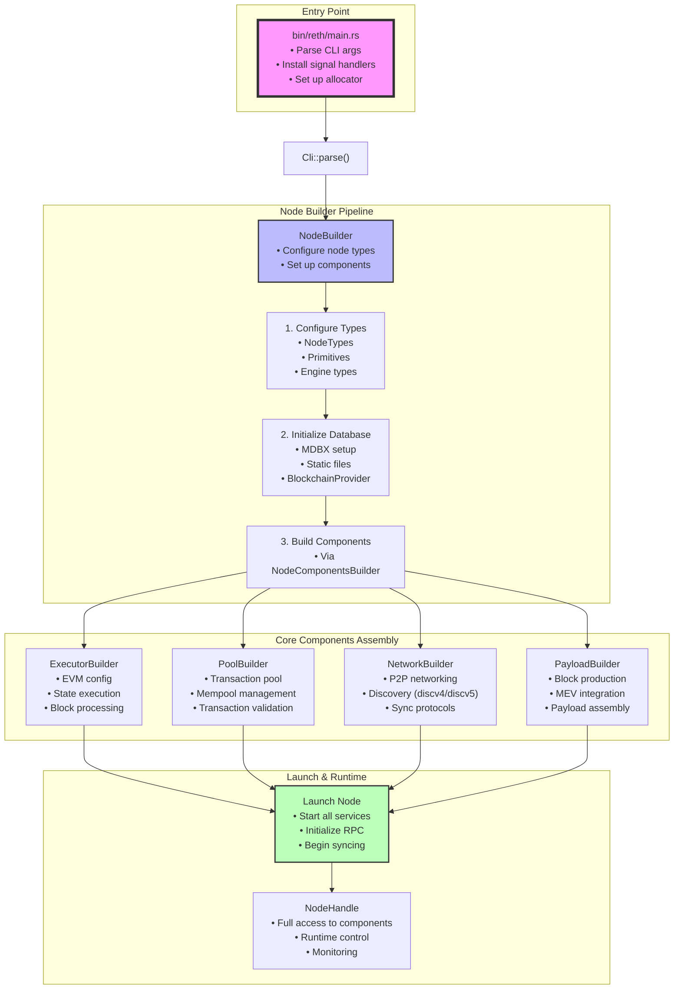
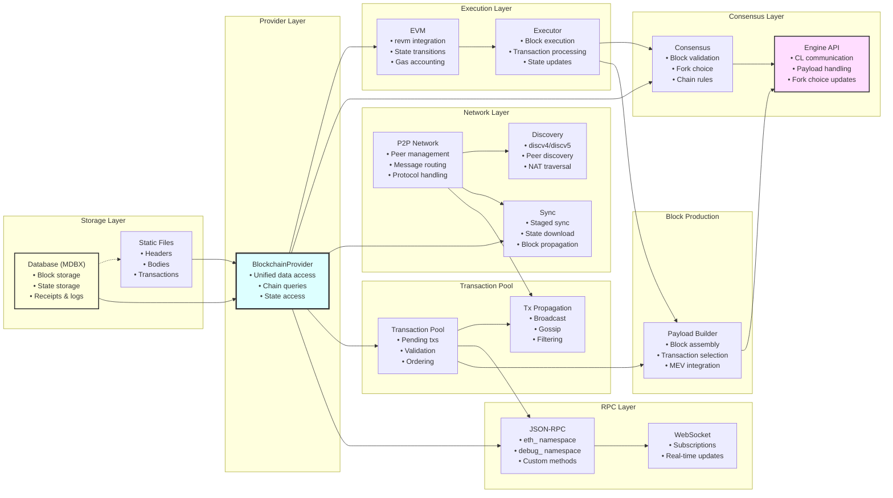
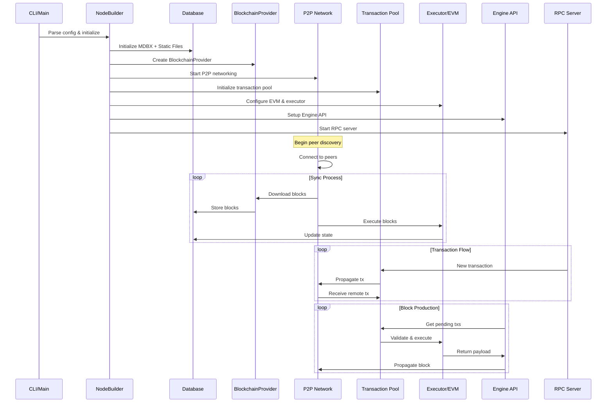

# Reth Architecture: Entry Point to Component Flow

## 🚀 Entry Point & Initialization Flow



## 📊 Component Dependency Graph



## 🔄 Data Flow Through Components



## 🏗️ Stage Pipeline Architecture

```mermaid
graph TD
    subgraph "Staged Sync Pipeline"
        Headers["Headers Stage<br/>• Download headers<br/>• Validate chain<br/>• Build skeleton"]
        Bodies["Bodies Stage<br/>• Download block bodies<br/>• Transaction data<br/>• Uncle blocks"]
        Senders["Senders Recovery<br/>• Recover tx senders<br/>• ECDSA recovery<br/>• Parallel processing"]
        Execution["Execution Stage<br/>• Execute transactions<br/>• Update state<br/>• Generate receipts"]
        MerkleUnwind["Merkle Unwind<br/>• Unwind state changes<br/>• Reorg handling"]
        AccountHashing["Account Hashing<br/>• Hash addresses<br/>• Prepare for trie"]
        StorageHashing["Storage Hashing<br/>• Hash storage keys<br/>• Optimize lookups"]
        MerkleExecute["Merkle Execute<br/>• Build state trie<br/>• Calculate roots"]
        TxLookup["Transaction Lookup<br/>• Build tx indices<br/>• Enable fast queries"]
        IndexHistory["Index History<br/>• Account history<br/>• Storage history"]
        
        Headers --> Bodies
        Bodies --> Senders
        Senders --> Execution
        Execution --> MerkleUnwind
        MerkleUnwind --> AccountHashing
        AccountHashing --> StorageHashing
        StorageHashing --> MerkleExecute
        MerkleExecute --> TxLookup
        TxLookup --> IndexHistory
    end
    
    style Headers fill:#e1f5fe,stroke:#01579b,stroke-width:2px
    style Execution fill:#fff3e0,stroke:#e65100,stroke-width:2px
    style MerkleExecute fill:#f3e5f5,stroke:#4a148c,stroke-width:2px
```



## 🎯 Key Component Interactions

### 1. **Main Entry → NodeBuilder**
- `bin/reth/main.rs` is the entry point
- Parses CLI arguments via `Cli::parse()`
- Creates `NodeBuilder` with configuration
- Launches node with specified chain (e.g., `EthereumNode`)

### 2. **NodeBuilder → Component Assembly**
The NodeBuilder follows a strict initialization order:
1. **Database Setup**: Initializes MDBX and static files
2. **Provider Creation**: Creates `BlockchainProvider` for unified data access
3. **Component Building**: Uses `NodeComponentsBuilder` to create:
   - **Executor**: EVM and state execution
   - **Transaction Pool**: Mempool management
   - **Network**: P2P and sync protocols
   - **Payload Builder**: Block production

### 3. **Runtime Component Connections**

#### Storage → Everything
- All components read from `BlockchainProvider`
- Provider abstracts MDBX + static files
- Provides chain data, state, receipts

#### Network → Sync → Executor
- Network downloads blocks from peers
- Sync stages process blocks sequentially
- Executor updates state via EVM

#### Transaction Pool → Network & RPC
- Receives transactions from RPC and P2P
- Validates and orders transactions
- Propagates to peers via network

#### Engine API → Consensus Layer
- Receives payloads from consensus client
- Triggers block production
- Updates fork choice

#### Executor → State
- Processes transactions through revm
- Updates account states
- Generates receipts and logs

### 4. **Service Lifecycle**

```
Start: CLI → NodeBuilder → Database → Components → Services
Run:   Network Sync ← → Transaction Pool ← → Block Production
Stop:  Graceful shutdown of all services in reverse order
```

## 🔧 Extension Points

The architecture provides several extension points:

1. **ExEx (Execution Extensions)**: Hook into block execution
2. **RPC Modules**: Add custom RPC methods
3. **Network Protocols**: Add custom P2P protocols
4. **Payload Attributes**: Customize block building
5. **Component Builders**: Replace default components

## 📝 Summary

Reth's architecture follows a clear flow from entry point to fully operational node:

1. **Entry** (`main.rs`) → **Configuration** (CLI parsing)
2. **Builder** (NodeBuilder) → **Database** (MDBX setup)
3. **Components** (via builders) → **Services** (launch)
4. **Runtime** (NodeHandle) → **Operation** (sync, validate, produce blocks)

Each component has clear dependencies and interfaces, making the system modular and extensible while maintaining type safety throughout.